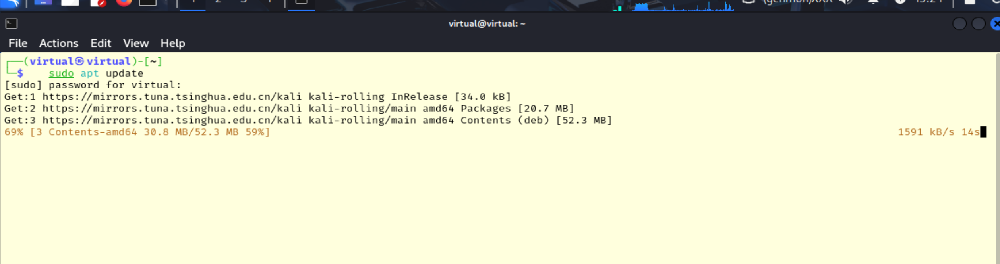
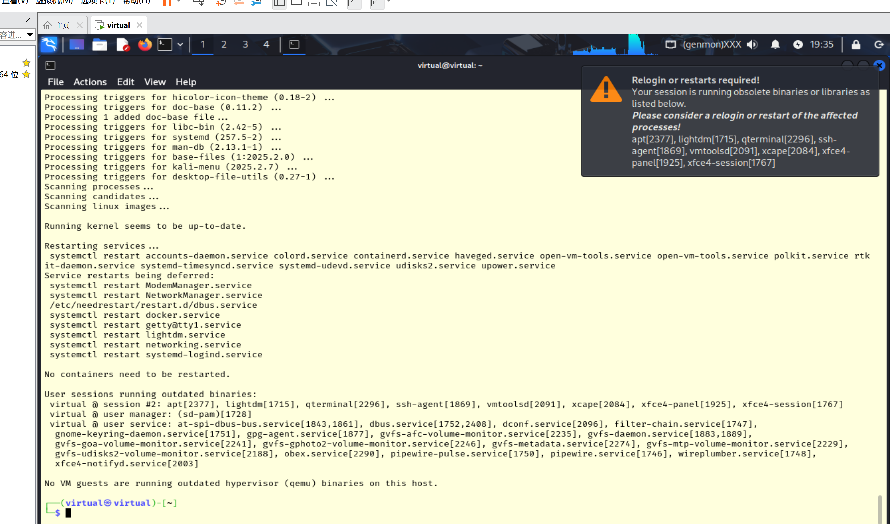
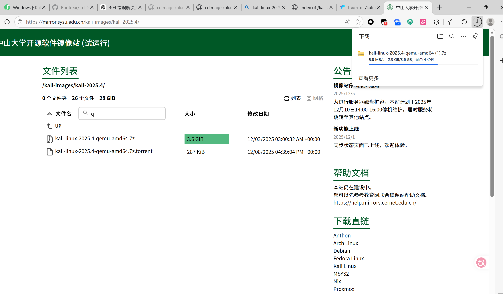
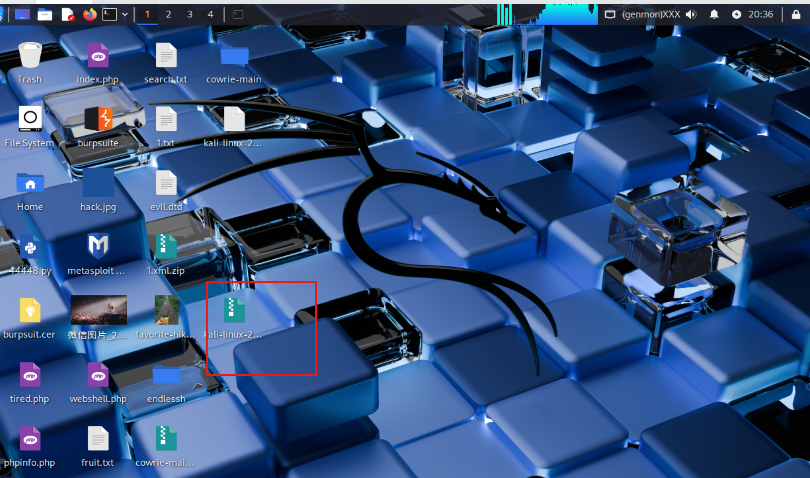
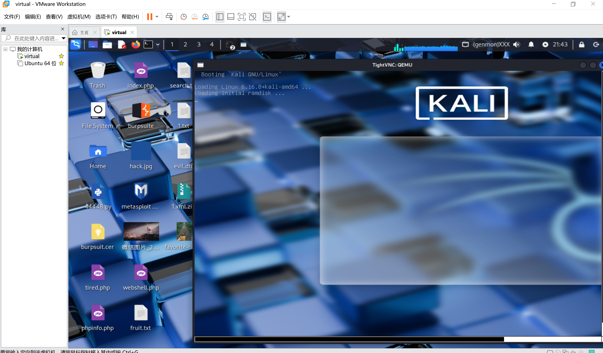

# 在VMware上搭建QEMU虚拟化技术

## 实验目的

1. 掌握QEMU虚拟化工具在Linux中的部署方法
2. 学习使用QEMU创建和管理虚拟机
3. 完成Linux系统在QEMU环境下的安装与配置

---

## 实验环境

主机系统：Windows

软件要求：
- QEMU 7.2 及以上（建议使用最新稳定版本）

## 知识说明

QEMU（Quick EMUlator）是一款开源的虚拟化与硬件仿真软件。它既可以作为虚拟机监控器（VMM）运行完整虚拟化环境，也可以用于用户态的二进制仿真与交叉架构测试。

主要功能与特点包括：
- 模拟多种处理器架构（如 x86、ARM、MIPS 等），支持在宿主机上运行不同架构的客机系统；
- 提供虚拟磁盘、虚拟网络、USB、声卡等设备的仿真与管理；
- 支持常见镜像格式（如 qcow2）、快照、镜像压缩与克隆；
- 可与 KVM 集成使用硬件虚拟化加速，以提升运行性能接近原生水平；

该节为后续实验步骤提供背景知识，便于理解镜像、磁盘与网络等设置的作用。

## 实验步骤

### 第一部分：QEMU 环境搭建

1. 更新系统软件包列表
```bash
sudo apt update
```



2. 安装 QEMU 组件
```bash
sudo apt install qemu-system-x86
```



3. 验证安装

```bash
qemu-system-x86_64 --version
# 示例输出：QEMU emulator version 10.2.0 (Debian 1:10.2.0+ds-2)
```

---

### **第二部分：虚拟机创建**


#### 1. 下载 QEMU 磁盘镜像

由于虚拟机内下载速度较慢，建议在宿主机（Windows）上使用浏览器下载镜像文件后再复制到虚拟机中。

可使用以下命令在宿主机或云端先查看可用的 Kali 版本：

```bash
curl -s https://cdimage.kali.org/ | grep "kali-"
```

根据输出选择合适版本并下载，例如：

https://mirror.sysu.edu.cn/kali-images/kali-2025.4/kali-linux-2025.4-qemu-amd64.7z



#### 2. 解压磁盘文件


```bash
cd /mnt/vmstorage
sudo 7z x kali-linux-2025.4-qemu-amd64.7z
```

#### 3. 启动虚拟机

```bash
sudo qemu-system-x86_64 -hda kali-linux-2025.4-qemu-amd64.qcow2 -m 2048 -smp 2 -net nic -net user
```

如需通过 VNC 远程查看图形界面，可在宿主或客机安装 VNC 客户端：

```bash
sudo apt update && sudo apt install xtightvncviewer -y
xtightvncviewer localhost:5900
```



启动后应能看到系统界面，表示运行成功。

## 遇到的问题

### 压缩包下载速度慢
虚拟机内下载速度较慢，改为在宿主机上下载镜像并将文件传入虚拟机。建议使用高校或镜像站点以提高下载速度。

### 虚拟机存储空间不足
初始磁盘空间不足，已将磁盘从 50GB 扩展到 80GB，之后建议监控磁盘使用并按需扩容。