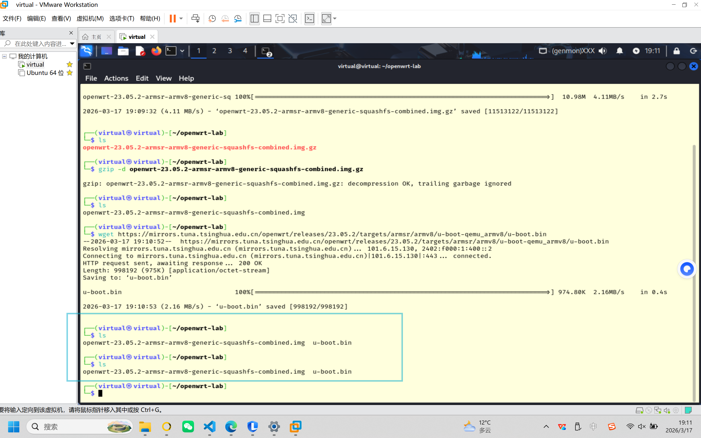
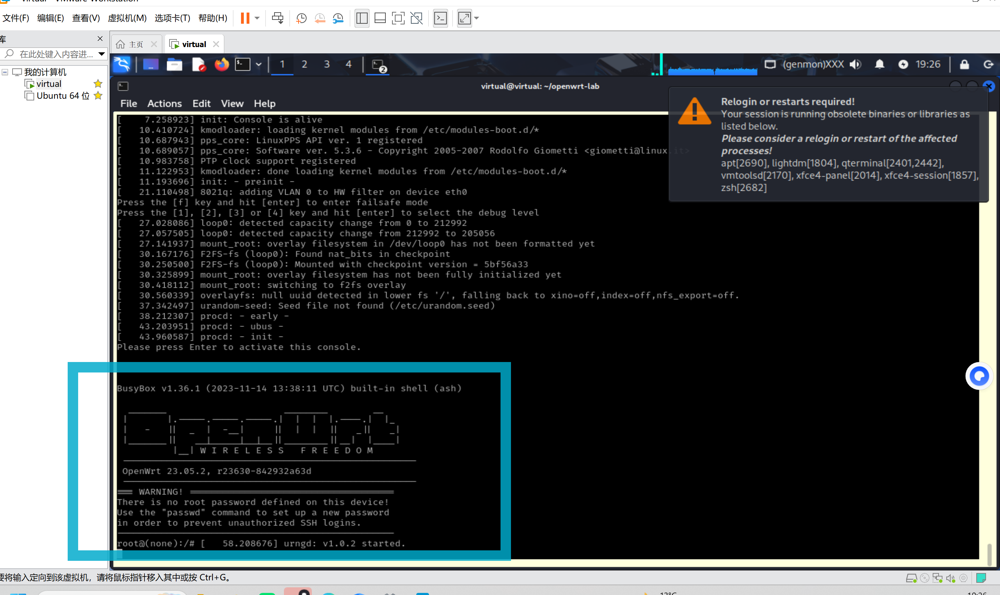
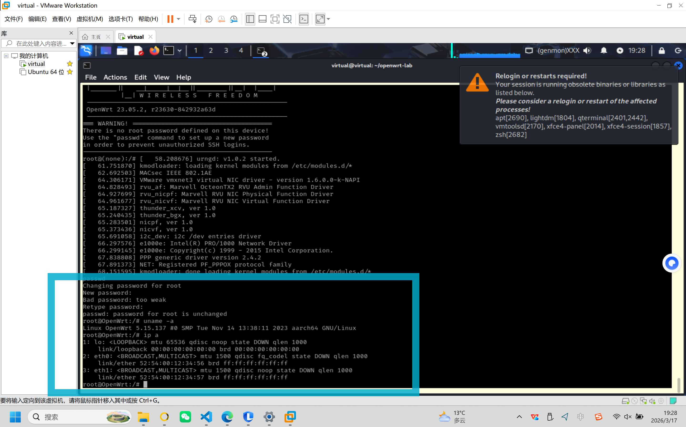
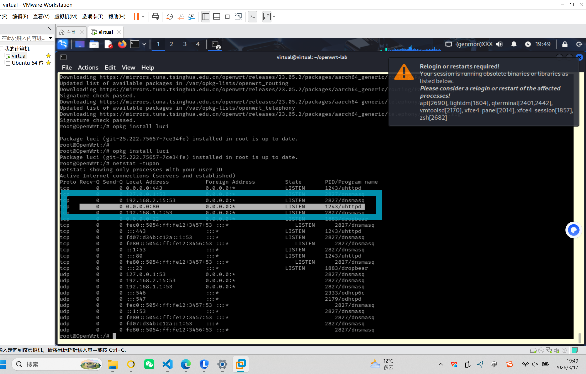
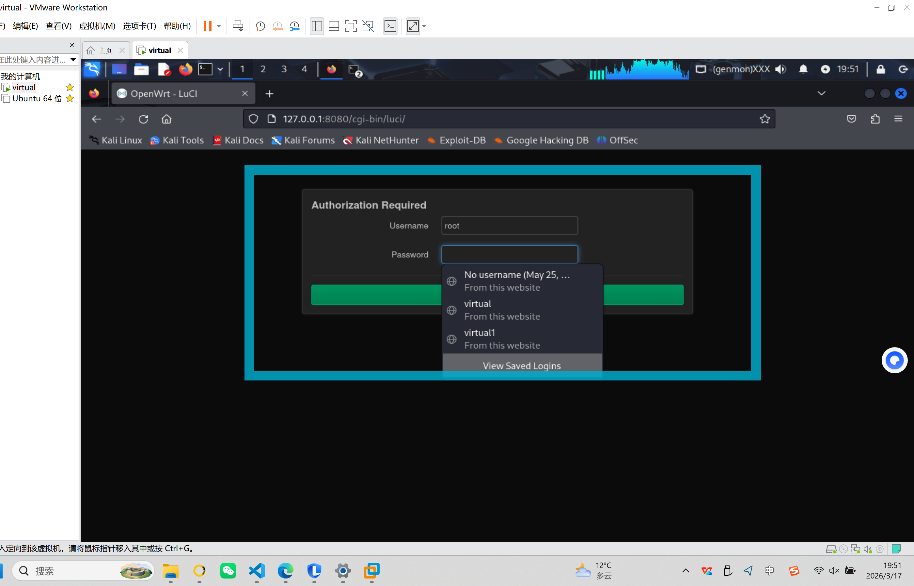
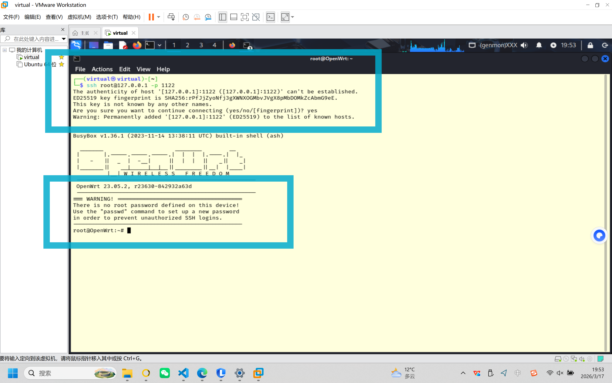

# 实验二：基于 QEMU 的 OpenWrt 仿真实验报告

## 1. 实验目的

- **仿真 OpenWrt 系统**：在 QEMU 虚拟环境中运行适用于 ARM 架构的 OpenWrt 镜像，验证系统能否正常启动并工作。
- **实现网页管理**：通过 Web 浏览器访问 LuCI 管理界面，确保 Web 服务正常运行。
- **实现 ssh 连接**：通过 ssh 连接到 OpenWrt 系统，验证 ssh 服务是否正常运行。

## 2. 实验环境

### 硬件平台
- Windows 11 家庭中文版
- ThinkBook 14 G5+IRH

### 软件环境
- VMware 虚拟机
- Kali Linux
- QEMU
- OpenWrt ARM 虚拟机镜像

## 3. 实验步骤

> 本文步骤专门适配我的环境：**Windows 11 主机 → VMware 虚拟机 → Kali Linux（已安装 QEMU）**。

### 3.1 在 Kali 中准备工作目录与镜像

在 Kali 终端执行：

```bash
mkdir -p ~/openwrt-lab
cd ~/openwrt-lab
wget https://mirrors.tuna.tsinghua.edu.cn/openwrt/releases/23.05.2/targets/armsr/armv8/openwrt-23.05.2-armsr-armv8-generic-squashfs-combined.img.gz
gzip -d openwrt-23.05.2-armsr-armv8-generic-squashfs-combined.img.gz
wget https://mirrors.tuna.tsinghua.edu.cn/openwrt/releases/23.05.2/targets/armsr/armv8/u-boot-qemu_armv8/u-boot.bin
```


说明：
- `openwrt-...img` 是 OpenWrt 系统盘镜像。
- `u-boot.bin` 是启动引导程序。

### 3.2 启动 QEMU（在 Kali 内）

在 `~/openwrt-lab` 目录下执行：

```bash
qemu-system-aarch64 -cpu cortex-a72 -m 1024 -M virt,highmem=off -nographic \
-bios u-boot.bin \
-drive file=openwrt-23.05.2-armsr-armv8-generic-squashfs-combined.img,format=raw,if=virtio \
-device virtio-net,netdev=net0 -netdev user,id=net0,net=192.168.1.0/24,hostfwd=tcp:127.0.0.1:1122-192.168.1.1:22,hostfwd=tcp:127.0.0.1:8080-192.168.1.1:80 \
-device virtio-net,netdev=net1 -netdev user,id=net1,net=192.168.2.0/24
```

关键点：
- 这是在 **Kali 虚拟机内部**运行，不是在 Windows 主机直接运行。
- `127.0.0.1:8080` 和 `127.0.0.1:1122` 也是指 **Kali 自己**。

### 3.3 首次进入 OpenWrt 控制台

启动后在当前终端进入 OpenWrt shell（必要时按回车）。

可执行以下命令检查系统状态：

```bash
uname -a
ip a
```

输出如下：
```bash
root@OpenWrt:/# uname -a                                         
Linux OpenWrt 5.15.137 #0 SMP Tue Nov 14 13:38:11 2023 aarch64 GNU/Linux                                                                                   
root@OpenWrt:/# ip- a                                                                                                                        
1: lo: <LOOPBACK> mtu 65536 qdisc noop state DOWN qlen 1000                                                                                                
    link/loopback 00:00:00:00:00:00 brd 00:00:00:00:00:00                                                                                                  
2: eth0: <BROADCAST,MULTICAST> mtu 1500 qdisc fq_codel state DOWN qlen 1000                                                                                
    link/ether 52:54:00:12:34:56 brd ff:ff:ff:ff:ff:ff                                                                                                     
3: eth1: <BROADCAST,MULTICAST> mtu 1500 qdisc noop state D
```

### 3.4 安装 LuCI 网页管理界面

在 OpenWrt shell 中执行：

```bash
opkg update
opkg install luci
```

检查 Web 服务是否已监听 80 端口：

```bash
netstat -tupan
```

若看到 `uhttpd` 监听 `0.0.0.0:80`，说明网页服务已启动。


### 3.5 验证网页访问（你当前环境专用路径）

有两种访问方式：

1. **在 Kali 内部浏览器访问**
	 - 打开 `http://127.0.0.1:8080`


2. **在 Windows 主机浏览器访问（可选）**
	 - 前提：VMware 网络允许主机访问该 Kali 虚拟机
	 - 若不通，优先在 Kali 内验证即可
     - 此处不做演示了

### 3.6 验证 SSH 连接

在 OpenWrt shell 中重启 SSH 服务：

```bash
/etc/init.d/dropbear restart
```

然后在 **Kali 新终端**执行：

```bash
ssh root@127.0.0.1 -p 1122
```


能成功进入 OpenWrt 命令行即表示 SSH 验证成功。

至此实验完成！

### 3.7 常见问题

- 访问不了 `127.0.0.1:8080`
	- 先确认 QEMU 进程仍在运行
	- 在 OpenWrt 内确认 `uhttpd` 已启动（`netstat -tupan`）

- SSH 连接失败
	- 先在 OpenWrt 内执行 `/etc/init.d/dropbear restart`
	- 确认端口映射参数中有 `hostfwd=tcp:127.0.0.1:1122-192.168.1.1:22`

- 想从 Windows 主机直接访问
	- 你的端口映射是绑定在 Kali 的 `127.0.0.1`，通常只能在 Kali 内访问
	- 课程实验中使用 Kali 内浏览器和终端验证即可满足要求