# 用户态固件仿真实验手册
姓名：李俊豪
学号：202312063053

---

## **实验目的**

1. 掌握`用户态`固件仿真的基本原理和技术
2. 使用 `FirmEmuHub` 工具进行用户态固件仿真
3. 复现 Tenda AC9 固件中的漏洞

---

## **实验环境**
- 主机系统：Windows11 家庭版
- 虚拟机系统：Ubuntu
- 硬件要求：
  - CPU：支持虚拟化技术
  - 内存：≥4GB
  - 存储：≥10G空间
- 软件要求：
  - Git
  - Docker（确保能成功拉取到dockerhub上的镜像）
  - Python 3.8+
  - IDA Pro 或 Ghidra

---

## **实验步骤**

### **第一部分：本地构建用户态仿真实验环境：Tenda AC9**

1. 在FirmEmuHub的Benchmark/BM-2024-00012文件夹中找到对应的Tenda AC9的.bin文件然后用binwalk工具处理，具体binwalk的使用请参考https://github.com/ReFirmLabs/binwalk，然后将binwalk的结果传到虚拟机中。
```bash
#首先安装binwalk
sudo apt install binwalk -i 
```

安装完成：
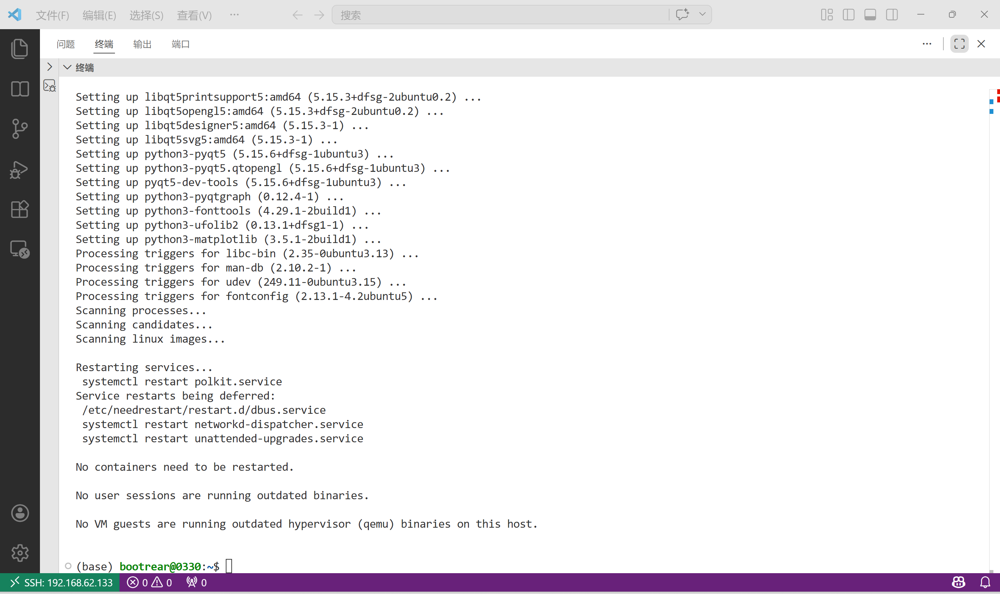

```bash
cd 0x03/FirmEmuHub-main/Benchmark/BM-2024-00012/emulation/firmware

unzip tenda_ac9.zip 
```
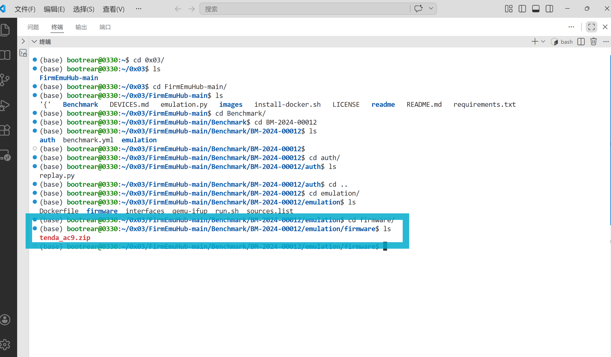

---

2. 安装qemu和网络配置工具

  ```bash
  # 安装的时候一路回车即可
  sudo apt-get install qemu 
  sudo apt-get install qemu-user-static
  sudo apt-get install qemu-system
  apt-get install bridge-utils uml-utilities
  ```

下载成功：
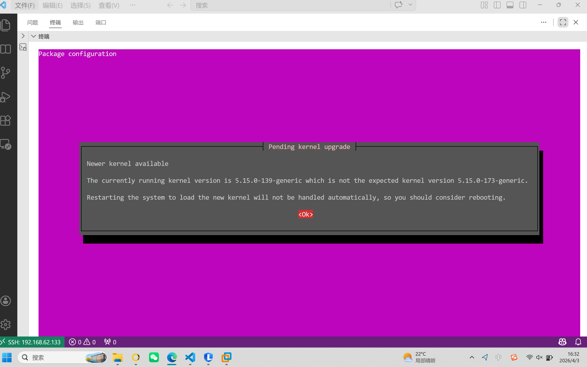

---

3. 网络配置
```
> ┌──(virtual㉿virtual)-[~/…/Benchmark/BM-2024-00012/emulation/firmware]
└─$ cat /etc/network/interfaces
# This file describes the network interfaces available on your system
# and how to activate them. For more information, see interfaces(5).

source /etc/network/interfaces.d/*

# The loopback network interface
auto lo
iface lo inet loopback

# The primary network interface
auto eth0
iface eth0 inet dhcp
```

```bash
  # 宿主机网络配置
  # /etc/network/interfaces 内容如下
  # ens33为当前宿主机网卡名
  
auto lo
iface lo inet loopback

auto ens33
iface ens33 inet manual

auto br0
iface br0 inet dhcp
bridge_ports ens33
bridge_stp off
bridge_fd 0
bridge_maxwait 0
```

然后重启网络
```bash
sudo ifdown ens33 || true
sudo ifup br0
```

### 第二部分：启动仿真实验

1. **启动 Tenda AC9 仿真环境**

```bash
cd ~/0x03/FirmEmuHub-main
sudo python3 emulation.py -b ./Benchmark/BM-2024-00012
```

2. **确认仿真输出信息**

- 终端中记录以下关键信息（建议截图）：
  - 固件名称
  - 映射端口（例如 32768、32771 等）
  - 启动成功提示

3. **Web 界面访问**

- 使用浏览器访问：`http://127.0.0.1:端口`
- 例如：`http://127.0.0.1:32768`
- 不建议使用 `http://0.0.0.0:端口` 进行访问。

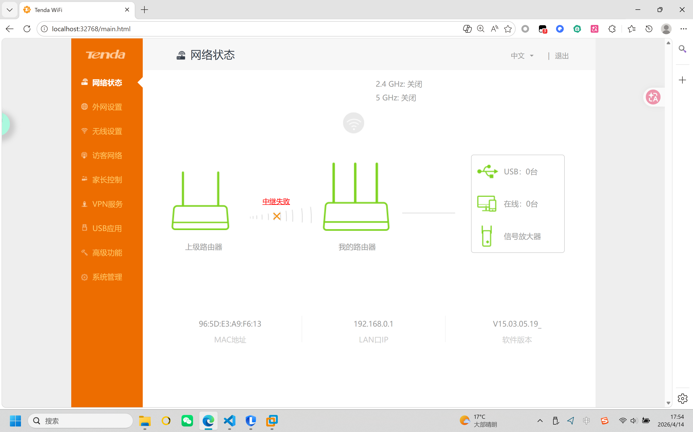

4. **基础连通性自检（可选但推荐）**

```bash
# 检查端口是否监听
ss -lntp | grep 32768

# 检查仿真进程
ps -ef | grep -E "emulation.py|qemu|httpd" | grep -v grep
```

---

### 第三部分：漏洞复现

#### **漏洞背景介绍**

本实验验证 [CVE-2018-18728](https://nvd.nist.gov/vuln/detail/CVE-2018-18728) 的命令注入问题。该漏洞位于 Tenda AC9 固件 Web 处理逻辑中，攻击者可通过构造特定请求触发不安全命令执行。

**漏洞详情：**
- 漏洞类型：命令注入（Command Injection）
- 影响组件：`bin/httpd`
- 触发接口：`/goform/SetSambaCfg`
- 触发条件：`action=del` 且 `usbName` 参数未做充分过滤

#### **漏洞原理分析（实验视角）**

在 Samba 配置处理流程中，程序会解析 POST 参数。当 `action` 满足特定条件时，`usbName` 参与后续命令构造并执行。由于缺少严格的输入校验，导致存在命令注入风险。

#### **漏洞复现步骤（安全验证方式）**

1. **抓取基准请求**

- 使用 Burp Suite 或 Yakit 打开代理。
- 进入路由器 Web 管理页的 USB/Samba 相关页面。
- 执行一次“保存/应用”操作，抓取 `POST /goform/SetSambaCfg` 请求。

2. **构造验证 Payload（无害）**

```http
POST /goform/SetSambaCfg HTTP/1.1
Host: 127.0.0.1:32775
Content-Type: application/x-www-form-urlencoded
Cookie: password=mtjcvb
Connection: close

password=111111&premitEn=0&internetPort=21&action=del&usbName=;echo%20POC_OK%20>%20/tmp/poc_201818728.txt;;&guestpwd=guest&guestuser=guest&guestaccess=r&fileCode=UTF-8
```

3. **发送请求并验证结果**

```bash
cat /tmp/poc_201818728.txt
```

- 若输出 `POC_OK`，说明注入链路已被触发。

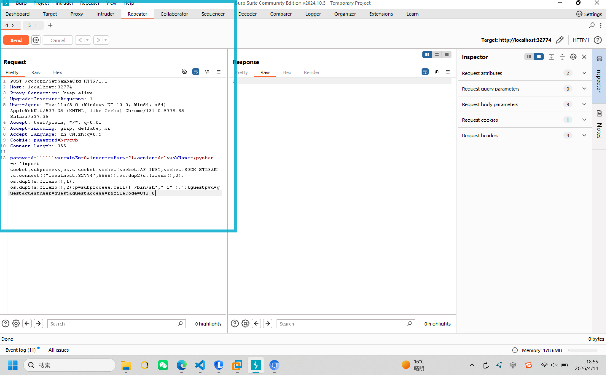

4. **结果记录建议**

- 截图 1：代理工具中 `SetSambaCfg` 请求详情（参数可打码）。
- 截图 2：终端中 `cat /tmp/poc_201818728.txt` 的结果。
- 截图 3：Web 页面可访问状态。

5. **常见问题与处理**

- 请求返回 401/跳转登录：Cookie 失效，重新登录并更新 Cookie。
- 页面无法保存：确认使用管理员账户，且等待页面 JS 加载完成。
- 无法写入 `/tmp`：检查固件根文件系统状态，或更换验证路径。

---

### **第四部分：漏洞逆向分析**

#### **分析目标**

通过静态分析确认第三部分的验证结果与程序逻辑一致，即：外部输入参数如何进入命令执行路径。

#### **分析步骤**

1. **定位目标文件**

- 在解包固件中找到 `bin/httpd`。
- 记录样本路径、大小（可选记录 hash 以增强报告完整性）。
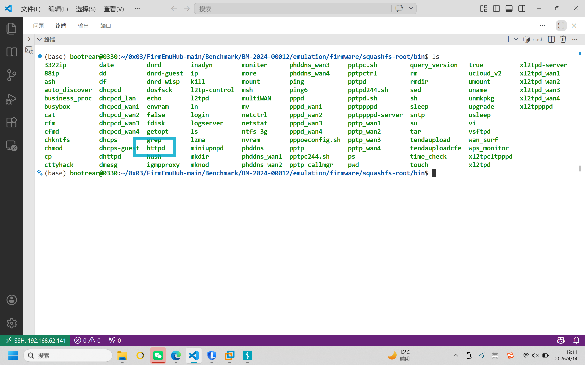
```bash
#打包到主机上
(base) PS D:\桌面\学习科目\大三下期末复习资料\物联网和工控安全\IoT-Security-and-ICS-Security\所有的作业文档整理在这\0x04> scp bootrear@192.168.62.141:/home/bootrear/0x03/FirmEmuHub-main/Benchmark/BM-2024-00012/emulation/firmware/squashfs-root/bin/httpd D:\桌面\学 习科目\大三下期末复习资料\物联网和工控安全\IoT-Security-and-ICS-Security\所有的作业文档整理在这\0x04
httpd                           100%  960KB  32.3MB/s   00:00 
```
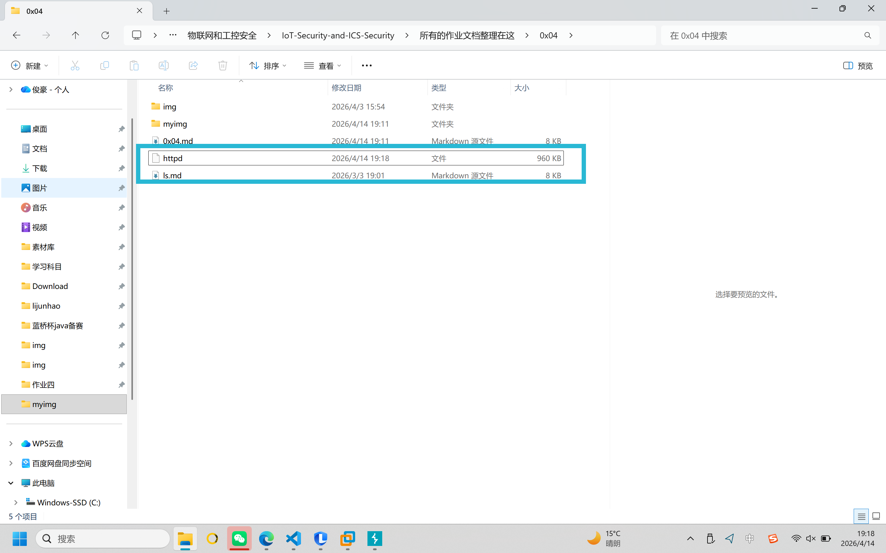

2. **使用 IDA 加载二进制**

- 打开 `httpd`，等待自动分析完成。
- 在 Strings 窗口搜索关键字符串，例如：`SetSambaCfg`、`cfm post`、`string_info`。
- 通过交叉引用（Xrefs）定位到对应处理函数（常见为 `formSetSambaConf`）。
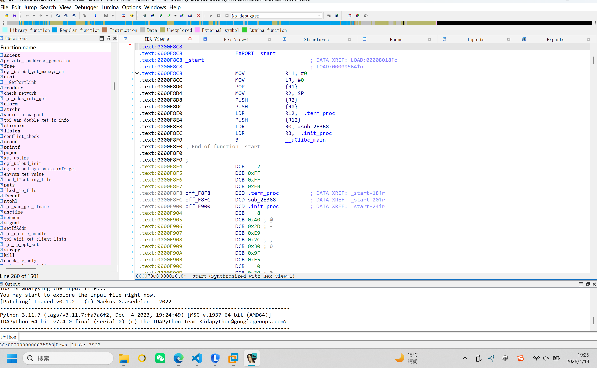
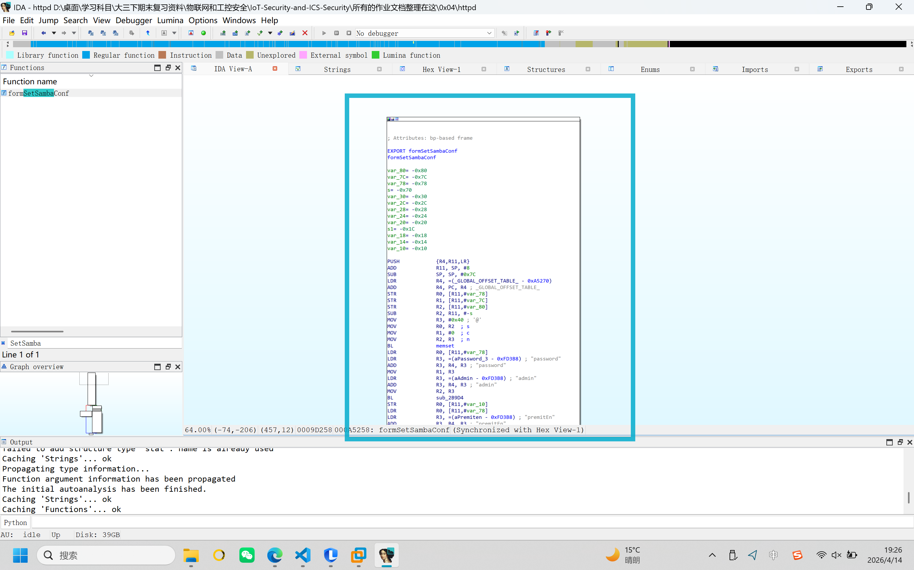

3. **追踪参数流**

- 确认 `action` 参数比较逻辑（是否匹配 `del`）。
- 确认 `usbName` 的读取与传递路径。
- 确认 `usbName` 是否进入命令执行函数（如 `doSystemCmd`）。
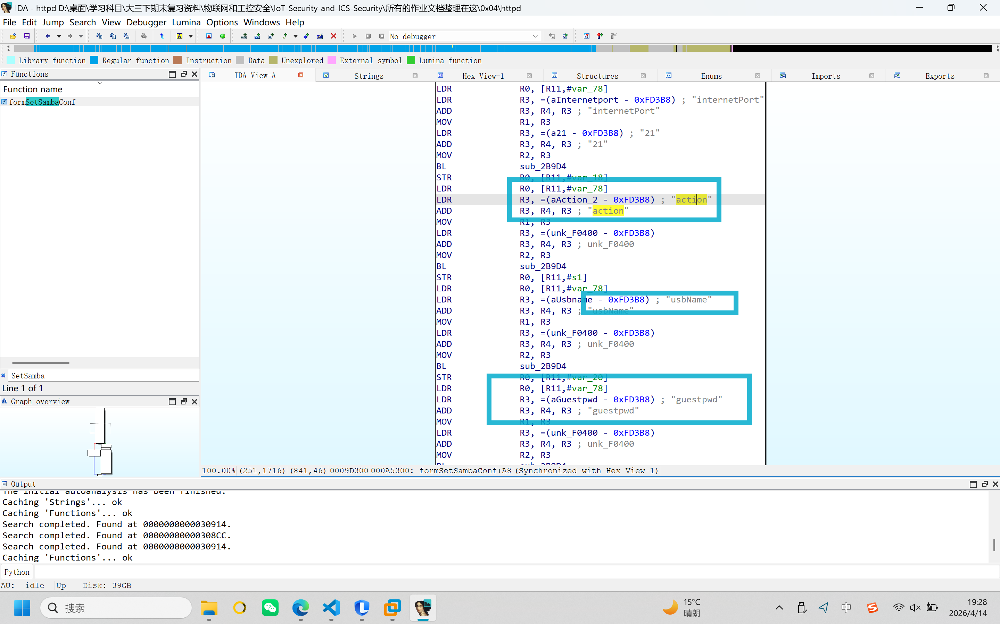

4. **形成漏洞链路结论**

- 输入点：`/goform/SetSambaCfg` 的 POST 参数。
- 控制条件：`action=del`。
- 危险汇点：`doSystemCmd` 调用。
- 结论：`usbName` 未充分过滤，导致命令注入风险成立。

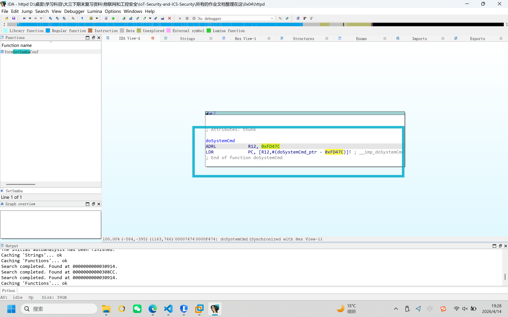

5. **与复现实验对照说明**

第三部分中修改的关键参数为 `usbName`，触发条件为 `action=del`；第四部分逆向分析确认该参数流可到达命令执行函数，两部分相互印证。

---

## **实验报告要求**

1. 详细记录用户态固件仿真的完整过程
2. 截取关键步骤的操作界面
3. 分析 CVE-2018-18728 漏洞的原理
4. 记录漏洞复现的过程和结果

---

## **附录**

1. **参考资源**
   - [漏洞分析参考](https://github.com/ZIllR0/Routers/blob/master/Tenda/rce1.md)

2. **注意事项**
   - 建议使用 Ubuntu 系统进行实验，某些环境下 Kali 可能存在仿真失败的情况
   - 确保 Docker 服务正常运行且能够成功拉取镜像
   - 实验过程中如遇到问题，请参考文档或咨询实验指导教师