# 固件Patch与动态调试实验手册

## **实验目的**

掌握固件补丁(Patch)的基本方法和技术

---

## **实验环境**

- 主机系统：Ubuntu（物理机或虚拟机、有GUI界面）、kali（有GUI界面）
- 硬件要求：
  - CPU：支持虚拟化技术
  - 内存：≥4GB
  - 存储：≥10G空间
- 软件要求：
  - Ghidra 10.0+或IDA Pro 7.0+ （图形化界面）
  - QEMU
  - Python 3.8+
  - GDB(可选)

---

## **实验步骤**

### **第一部分：仿真原始 Tenda AC9固件**

#### **1. Tenda AC9固件仿真问题背景**

在上次实验中，我们成功地在用户态下仿真了tenda ac9的固件，但是那个固件是经过我们特殊处理（即patch）后的固件，今天我们将尝试仿真原始固件并学会patch的操作。

Tenda AC9固件(未被patch过的版本)在运行过程中会出现"假死"现象，主要原因是其在初始化过程中试图访问不存在的硬件导致无法仿真。所以我们需要通过patch来修改相关函数逻辑，跳过这些访问硬件的代码。

#### **2. 获取并准备固件**

在官网下载固件：

https://www.tenda.com.cn/material/show/102682


```bash
# 使用binwalk提取文件系统
binwalk -Me ./ac9_kf_V15.03.05.19\(6318_\)_cn.zip

# 安装qemu的软件以及相关组件
  sudo apt-get install qemu-user
  sudo apt-get install qemu
  sudo apt-get install qemu-user-static
  sudo apt-get install qemu-system
  sudo apt-get install bridge-utils uml-utilities
```

#### **3. 尝试在用户态下仿真原始固件**

`注`:针对于上次实验中无法仿真的问题的解决方案:

将下方的网络配置中有关于`仅host网卡`的网卡连接方式根据本机的具体情况改成`nat`或者`其他`,此外若是80端口被占用，可以停止当前80端口运行的服务或者指定其他端口

>查看占用80端口的程序 使用以下命令查看当前哪个程序正在占用80端口：
>bash复制sudo netstat -tulnp | grep ':80'
>关闭占用80端口的程序 根据上一步查找到的PID（进程ID），使用kill命令关闭该程序。例如，如果PID是1234：
>bash复制sudo kill -9 1234

```bash
# 宿主机网络配置
  # /etc/network/interfaces 内容如下
  
  auto lo
  iface lo inet loopback

  auto eth0 # 上次实验这里写的是enp0s8
  iface eth0 inet dhcp # 上次实验这里写的是enp0s8

  auto br0
  iface br0 inet dhcp
  bridge_ports eth0 # 上次实验这里写的是enp0s8
  bridge_maxwait 0

  # /etc/qemu-ifup内容如下

  #! /bin/sh
  echo "Executing /etc/qemu/ifup"
  echo "Bringing up $1 bridged mode..."
  sudo /sbin/ifconfig $1 0.0.0.0 promisc up
  echo "Adding $1 to br0..."
  sudo /sbin/brctl addif br0 $1
  sleep 3

  $ sudo chmod a+x /etc/qemu-ifup
  # 重启网络配置
  sudo systemctl restart systemd-networkd.service

  # 安装ifupdown，设置网口
  sudo apt install ifupdown
  sudo ifdown br0 && sudo ifup br0
```

```
  # 添加可执行权限
  cd _ac9_kf_V15.03.05.19\(6318_\)_cn.zip.extracted/_ac9_kf_V15.03.05.19\(6318_\)_cn.bin.extracted/squashfs-root
  
  # 将对应的qemu用户态静态启动程序拷贝到当前路径，以便在chroot环境下使用
  sudo cp /usr/bin/qemu-arm-static qemu-arm-static
  
  # 环境修复
  cp -r webroot_ro/* webroot/

  # 赋予bin/httpd执行权限
  ls -l bin/httpd
  chmod +x bin/httpd
  
  # 启动命令
  sudo qemu-arm -L ./ bin/httpd
```

会发现与上次实验中的显示不同,一直卡在这个界面或者报错，且无法在web页面访问：

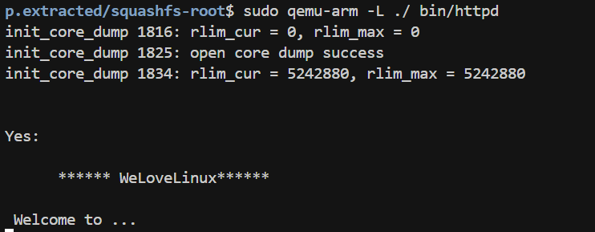

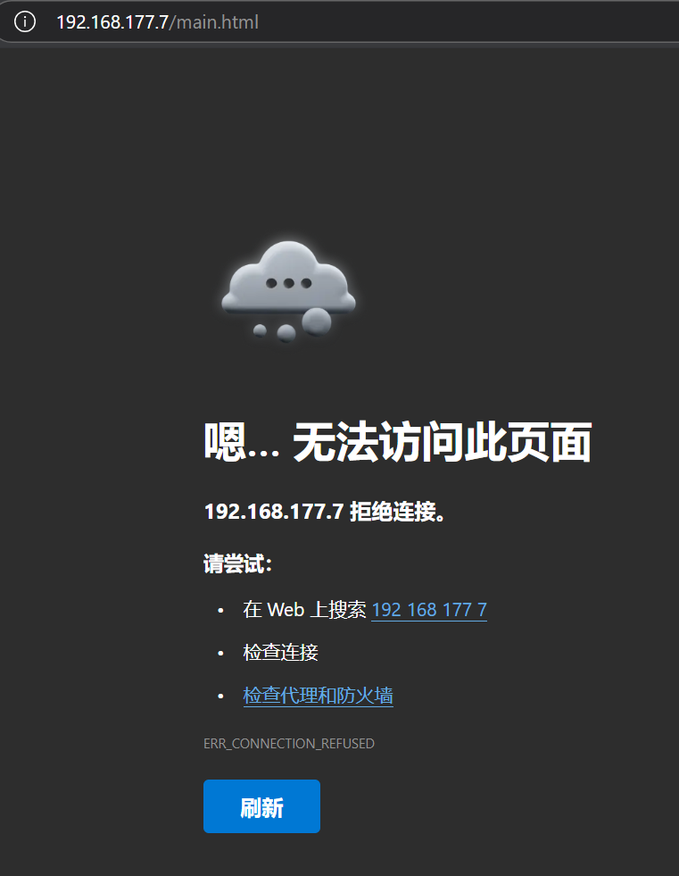

### **第二部分：对原始的二进制文件进行patch**

#### **1. 安装并使用Ghidra来patch固件**（此实验手册仅介绍ghidra的patch方法，使用IDA pro的原理一致）

1. 安装Ghidra
2. 启动Ghidra并创建新项目

```bash
# 建议在有图形化/GUI界面的Ubuntu或kali上安装，在windows也可以进行安装和配置
sudo apt update

# 安装ghidra
sudo apt install ghidra

# 启动ghidra
ghidra
```

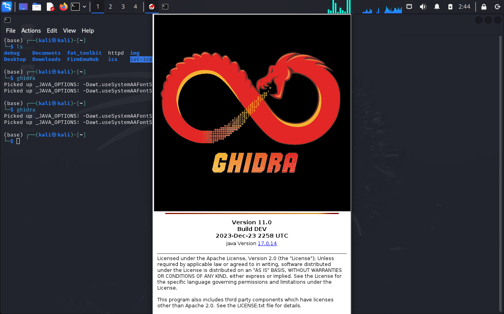

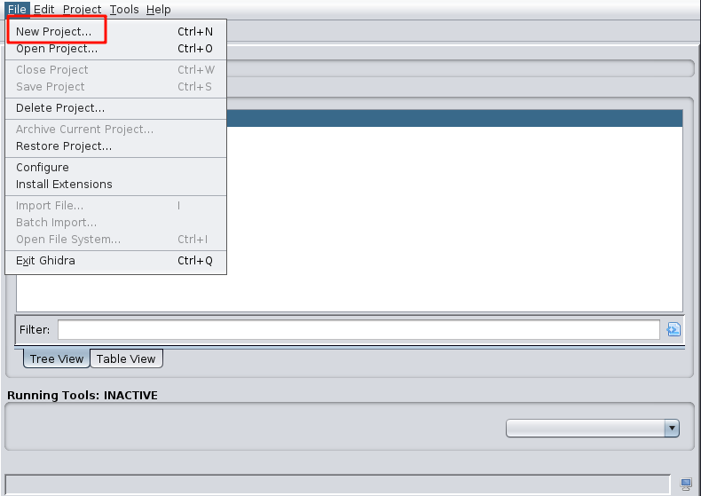

选择`None-shared project`,后选一个ghidra的project文件夹的存储位置以及project的命名

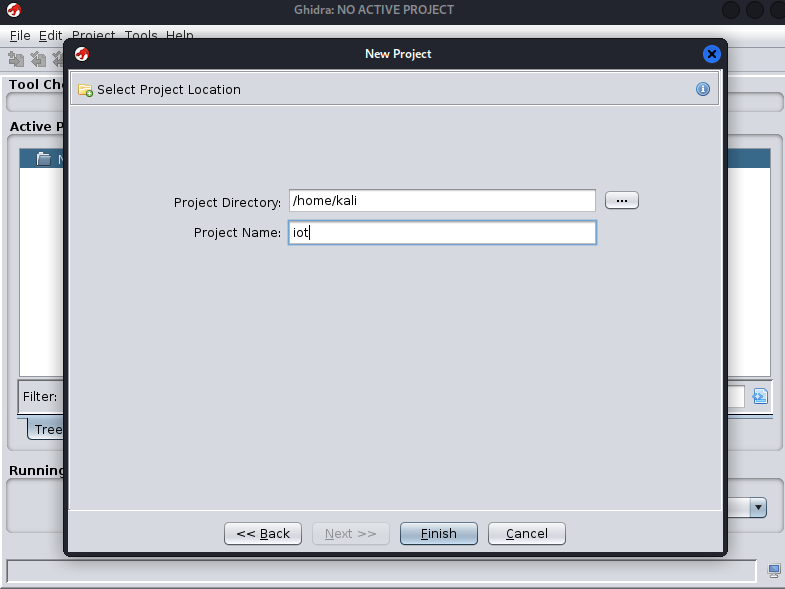

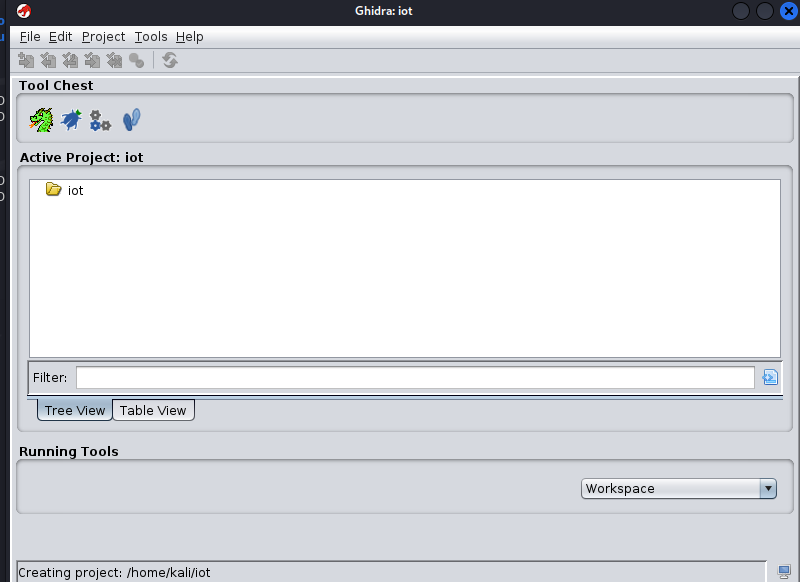

在这里导入我们需要进行patch的httpd二进制程序,后会出现该二进制文件的相关信息，点击`ok`

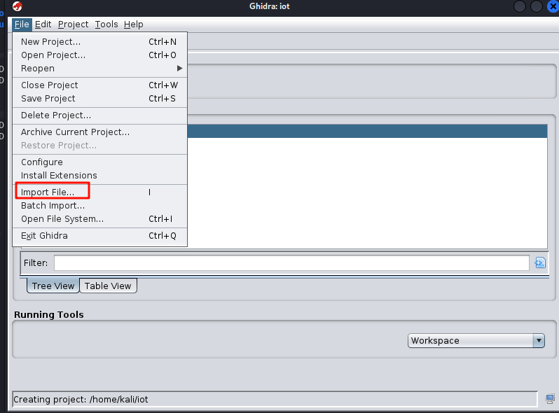

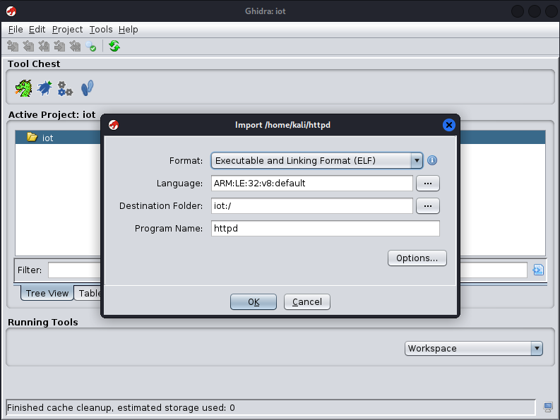

然后会出现一个关于此二进制文件初步的分析报告，点击ok,会发现httpd已经成功导入了名为`iot`的project工程文件夹中，双击`httpd`

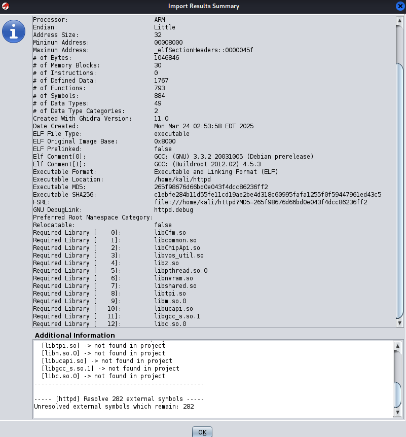

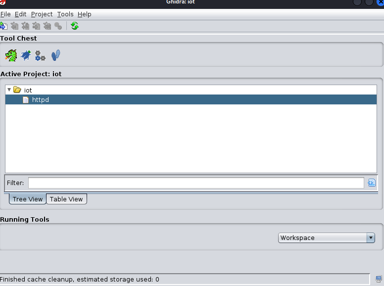

会发现有一个小绿龙飘过，然后进入ghidra的窗口，点击两次`yes`或`analyze`

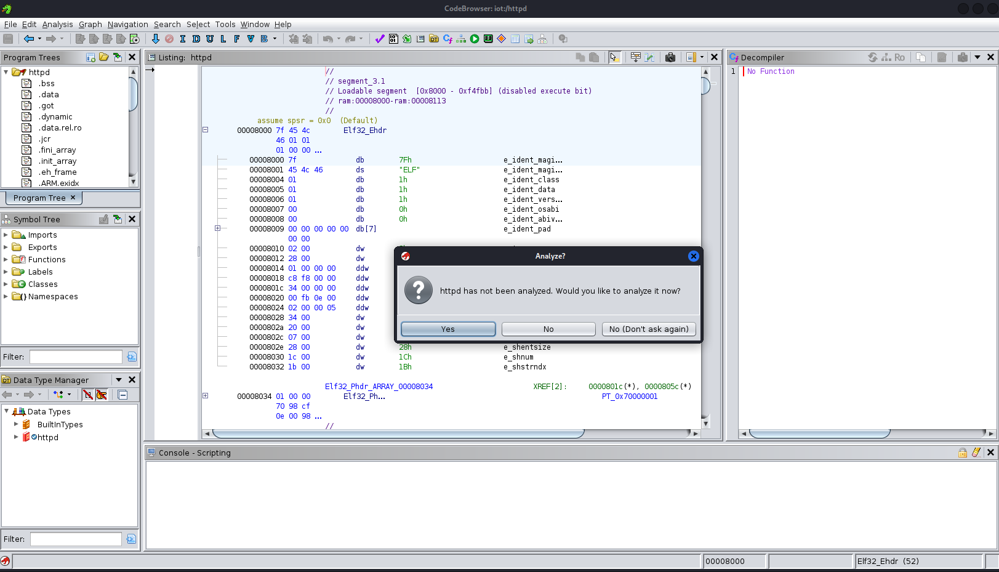

然后我们可以点击`Navigation`->`go to ……`或者直接划到对应的地址`0x0002E47C`

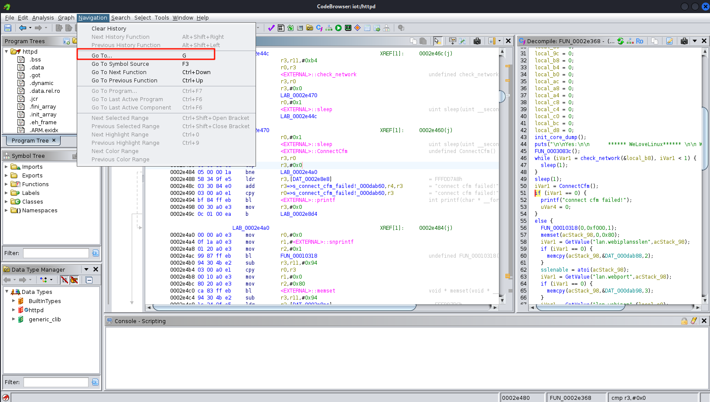

右键该地址或者`ctrl`+`shift`+`g`，对这里的汇编代码进行修改，修改成`MOV R3, 1 `即`01 30 A0 E3`

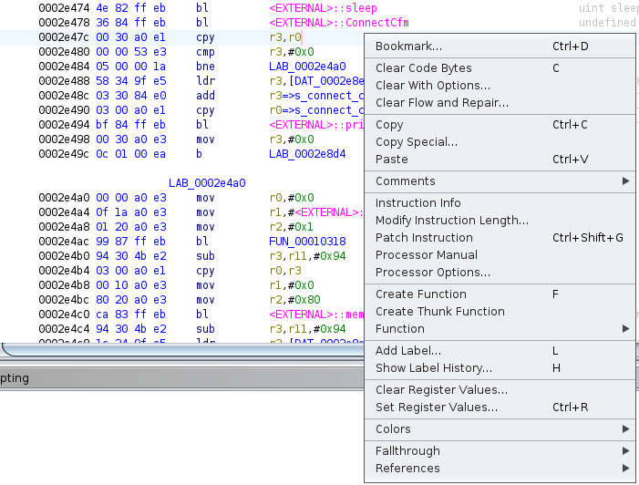

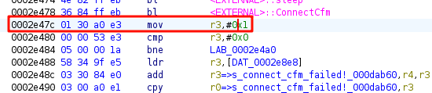

这时我们就已经修改好了，接下来做的操作是保存patch好的二进制文件

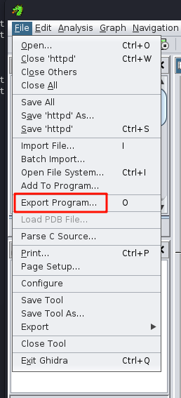

选择保存的格式为`original file`

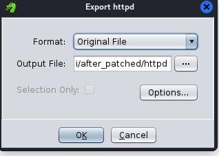

然后将patch好的二进制程序重新导回到我们的启动`qemu仿真`的位置，然后重新启动一遍

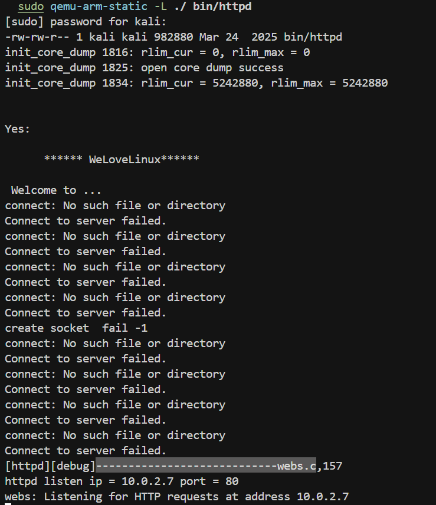

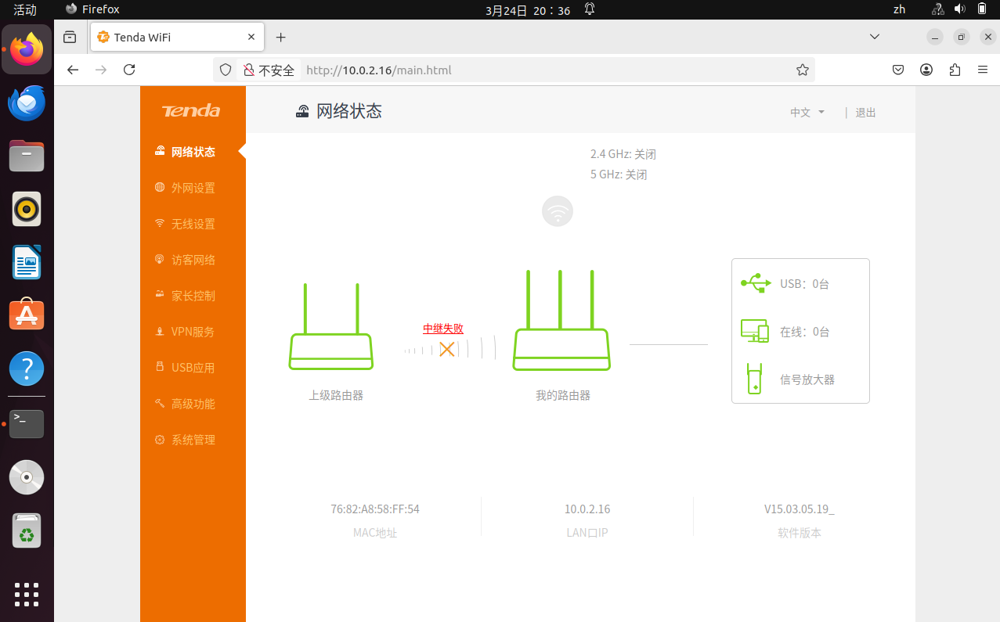

---

### **第三部分：逆向分析patch固件二进制程序的原理以及原因**

修改前的汇编代码：

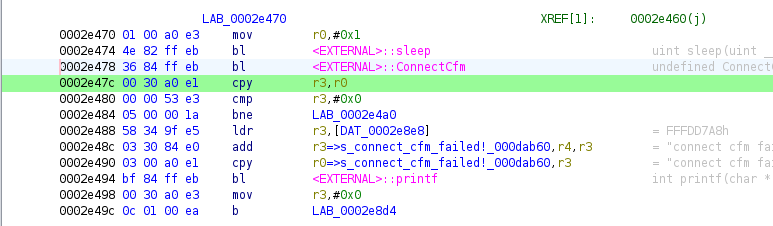

对应的反汇编后得到的伪代码：

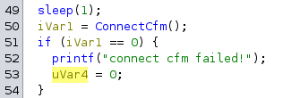

在这里我们可以看到这里做了一个硬件连接的检测，我们可以把`iVar`的值直接赋值成常量1，使其不用判断硬件连接的检测

所以我们修改后的汇编代码如下：

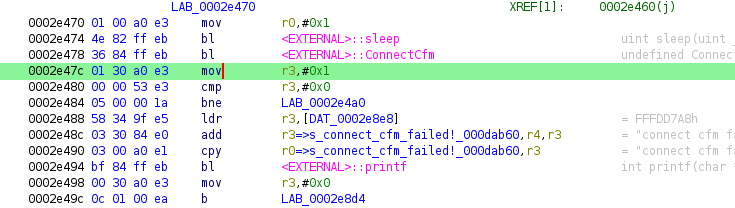

对应的反汇编后得到的伪代码：


这里我们发现没有进行对应的硬件连接的检测，因而不会卡住或报错

---

## **实验报告要求**

1. 详细记录固件Patch的过程，包括分析“假死”问题的方法和解决方案
2. 截取Ghidra/IDA动态调试的关键操作界面
3. 记录遇到的问题及解决方法

---

## **附录**

1. **参考资源**
   - [Tenda AC9漏洞分析参考](https://github.com/ZIllR0/Routers/blob/master/Tenda/rce1.md)
   - [Ghidra调试教程](https://www.cnblogs.com/wingsummer/p/16709970.html)
   - [Tenda AC9固件分析](https://www.anquanke.com/post/id/231445)

2. **命令速查表**
   ```bash
   # QEMU调试命令
   sudo qemu-arm-static -g <port> -L ./ <binary>
   
   # GDB连接命令
   gdb-multiarch
   target remote localhost:<port>
   
   # Patch二进制文件命令
   dd if=<新数据文件> of=<目标二进制> bs=1 seek=<偏移量> count=<字节数> conv=notrunc
   ```
