# 0x06 GDB调试与栈溢出实验
姓名：李俊豪
学号：202312063053

---

## 实验目标

- 学习使用GDB调试工具的基本操作
- 理解栈溢出漏洞的原理
- 掌握使用GDB分析栈溢出漏洞的方法
- 实践通过栈溢出漏洞改变程序控制流的基本技术

## 实验环境

- 操作系统：Linux (推荐Ubuntu 20.04或更高版本)
- 工具：GDB (GNU Debugger)
- 编译器：GCC

## 实验准备

在开始实验前，请确保您的系统已安装GDB和GCC：

```bash
sudo apt update
sudo apt install gdb gcc
```
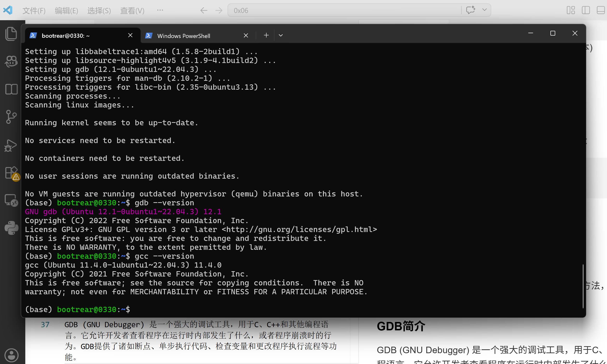

---

## 实验内容

### 实验一：GDB基础操作

在这个实验中，我们将学习GDB的基本命令和操作方法，通过调试一个简单的程序来熟悉GDB的使用。

#### GDB简介

GDB (GNU Debugger) 是一个强大的调试工具，用于C、C++和其他编程语言。它允许开发者查看程序在运行时内部发生了什么，或者程序崩溃时的行为。GDB提供了诸如断点、单步执行代码、检查变量和更改程序执行流程等功能。

#### 步骤1：创建一个简单的C程序

创建一个名为`hello.c`的文件，内容如下：

```c
#include <stdio.h>

int main() {
    int a = 10;
    int b = 20;
    int c = a + b;
    
    printf("a = %d, b = %d, c = %d\n", a, b,  c);
    
    for(int i = 0; i < 5; i++) {
        printf("i = %d\n", i);
    }
    
    return 0;
}
```
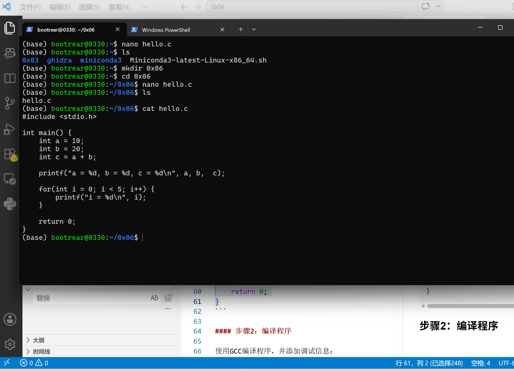

#### 步骤2：编译程序

使用GCC编译程序，并添加调试信息：

```bash
gcc -g hello.c -o hello
```
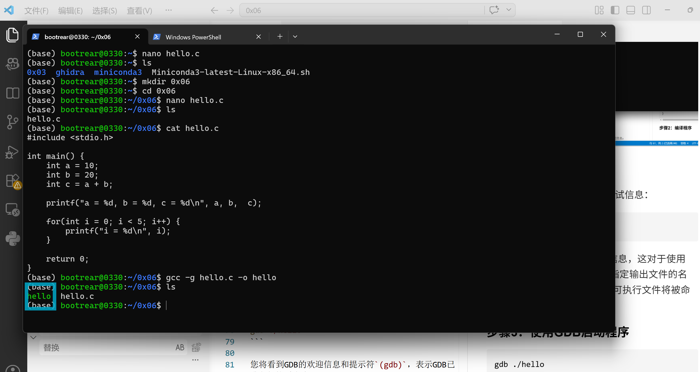

参数`-g`告诉编译器生成调试信息，这对于使用GDB调试是必要的。参数`-o`指定输出文件的名称，在这个例子中，编译后的可执行文件将被命名为`hello`。

#### 步骤3：使用GDB启动程序

```bash
gdb ./hello
```

您将看到GDB的欢迎信息和提示符`(gdb)`，表示GDB已准备好接受命令。
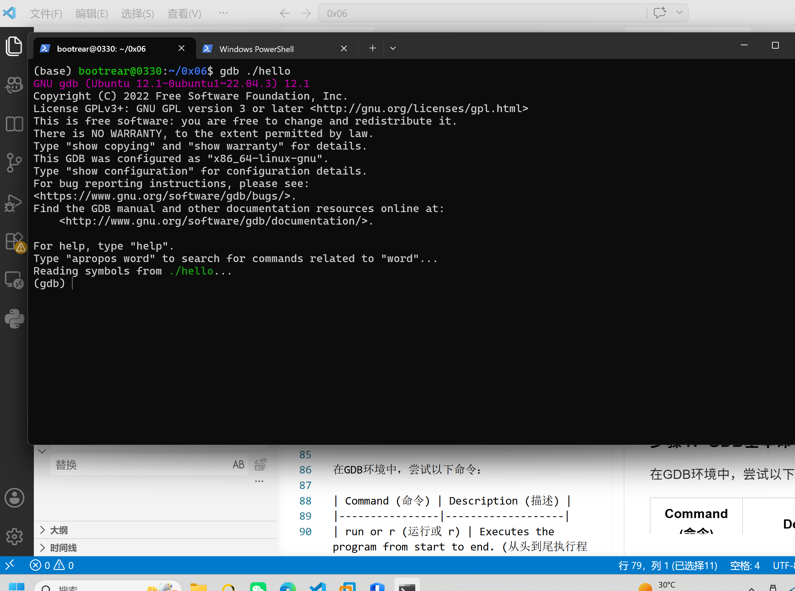


#### 步骤4：GDB基本命令练习

在GDB环境中，尝试以下命令：

| Command (命令) | Description (描述) |
|----------------|-------------------|
| run or r (运行或 r) | Executes the program from start to end. (从头到尾执行程序。) |
| break or b (断点或 b) | Sets a breakpoint on a particular line. (在特定行设置断点。) |
| disable (禁用) | Disables a breakpoint. (禁用断点。) |
| enable (启用) | Enables a disabled breakpoint. (启用已禁用的断点。) |
| next or n (下一个或 n) | Executes the next line of code without diving into functions. (执行下一行代码，不进入函数。) |
| step (步骤) | Goes to the next instruction, diving into the function. (跳转到下一个指令，进入函数。) |
| list or l (列表或 l) | Displays the code. (显示代码。) |
| print or p (打印或 p) | Displays the value of a variable. (显示变量的值。) |
| quit or q (退出或 q) | Exits out of GDB. (从 GDB 中退出。) |
| clear (清除) | Clears all breakpoints. (清除所有断点。) |
| continue (继续) | Continues normal execution. (继续正常执行。) |

1. **显示代码**：
   ```
   (gdb) list
   ```
   或简写为：
   ```
   (gdb) l
   ```
   这将显示程序的源代码。默认情况下，`list`命令显示10行代码。
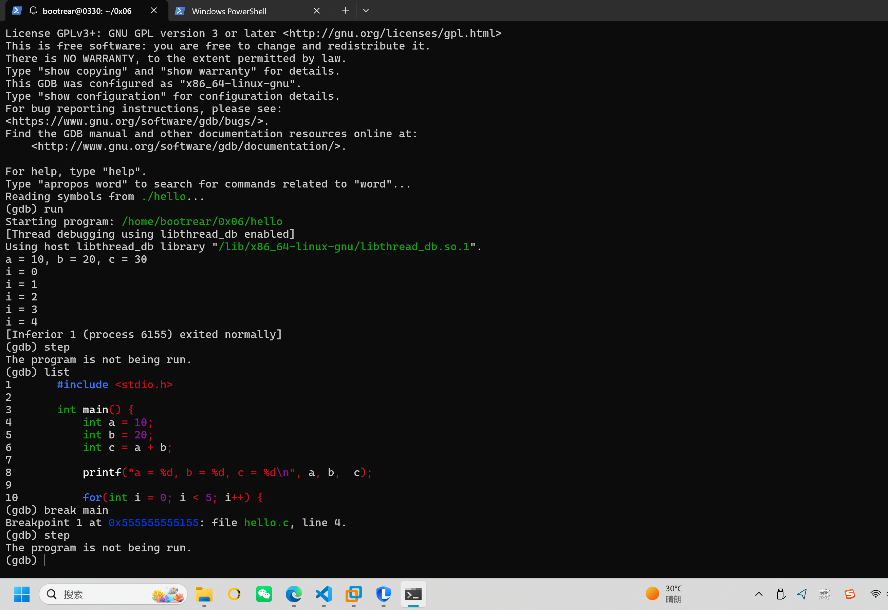

2. **设置断点**：
   ```
   (gdb) break main
   ```
   或简写为：
   ```
   (gdb) b main
   ```
   这将在`main`函数的开始处设置断点。

   您也可以在特定行设置断点：
   ```
   (gdb) break 9  # 在第9行设置断点
   ```
   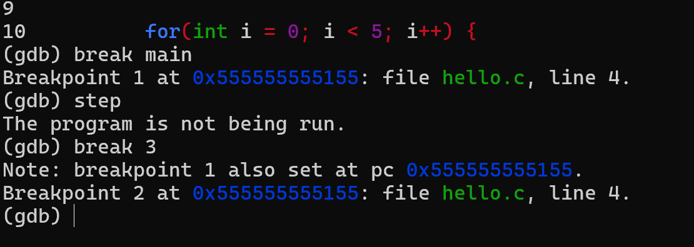

3. **查看所有断点**：
   ```
   (gdb) info breakpoints
   ```
   或简写为：
   ```
   (gdb) info b
   ```
   这将显示所有设置的断点信息。
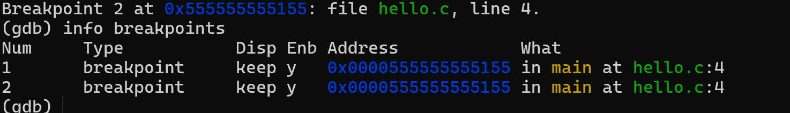

4. **禁用断点**：
   ```
   (gdb) disable 1  # 禁用断点1
   ```
   这将暂时禁用指定的断点，但不会删除它。
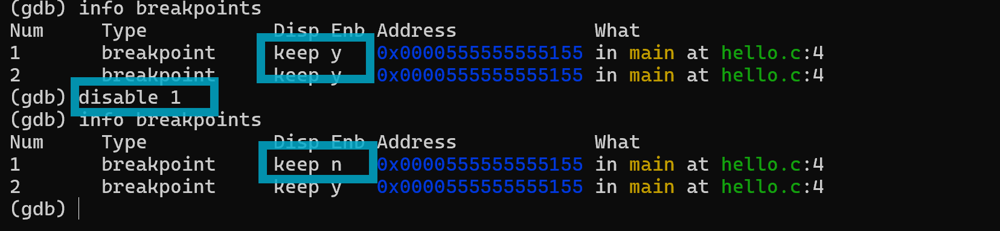

5. **启用断点**：
   ```
   (gdb) enable 1  # 启用断点1
   ```
   这将重新启用之前禁用的断点。
   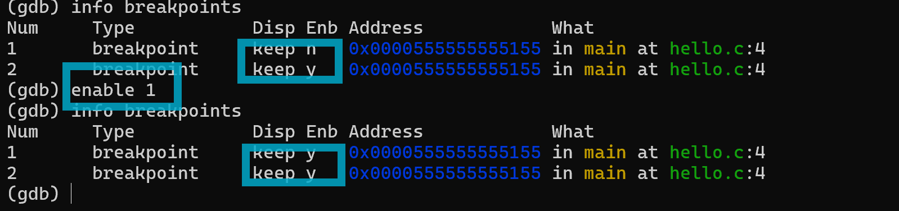

6. **运行程序**：
   ```
   (gdb) run
   ```
   或简写为：
   ```
   (gdb) r
   ```
   这将开始执行程序，直到遇到断点或程序结束。
   

7. **单步执行（进入函数）**：
   ```
   (gdb) step
   ```
   或简写为：
   ```
   (gdb) s
   ```
   这将执行当前行，如果当前行包含函数调用，则会进入该函数。
   

8. **单步执行（不进入函数）**：
   ```
   (gdb) next
   ```
   或简写为：
   ```
   (gdb) n
   ```
   这将执行当前行，但不会进入函数调用。
   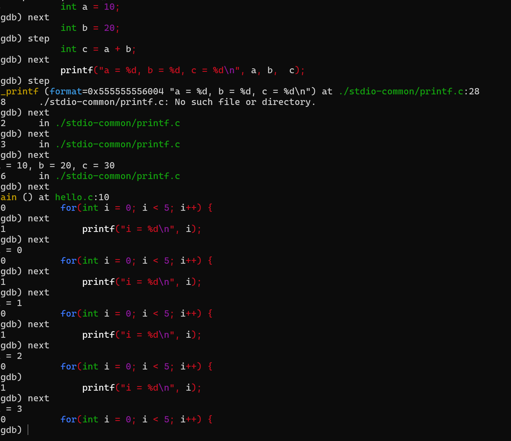

9. **查看变量值**：
   ```
   (gdb) print a
   ```
   或简写为：
   ```
   (gdb) p a
   ```
   这将显示变量`a`的当前值。
   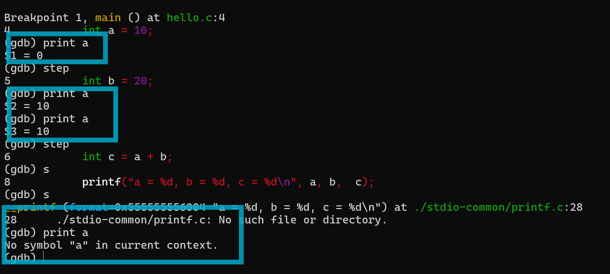

10. **修改变量值**：
    ```
    (gdb) set variable a = 100
    ```
    或简写为：
    ```
    (gdb) set a = 100 (PS:在该实验不行，会出现不知道指代的a是啥，从而无法赋上值)
    ```
    这将修改变量`a`的值为100。
    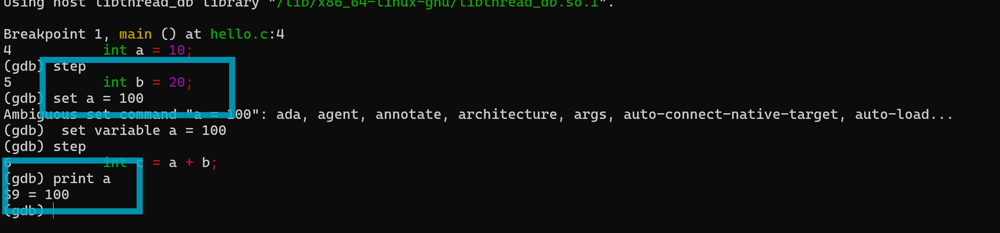

11. **继续执行直到下一个断点**：
    ```
    (gdb) continue
    ```
    或简写为：
    ```
    (gdb) c
    ```
    这将继续执行程序，直到遇到下一个断点或程序结束。
    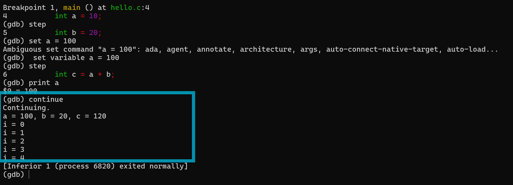

12. **删除断点**：
    ```
    (gdb) delete 1  # 删除断点1
    ```
    或简写为：
    ```
    (gdb) d 1
    ```
    这将永久删除指定的断点。
    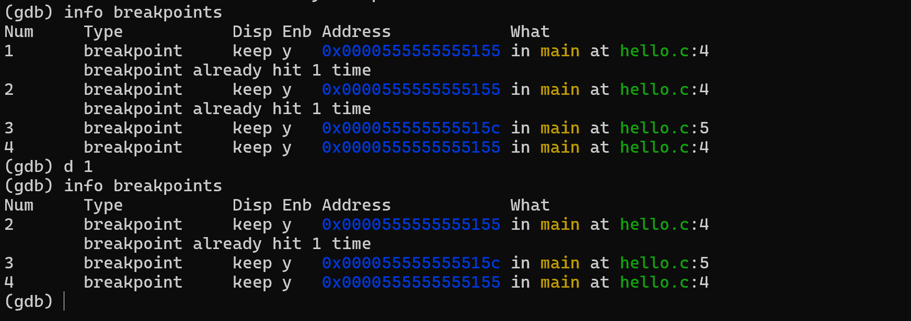

13. **清除所有断点**：
    ```
    (gdb) clear
    ```
    这将删除所有设置的断点。
    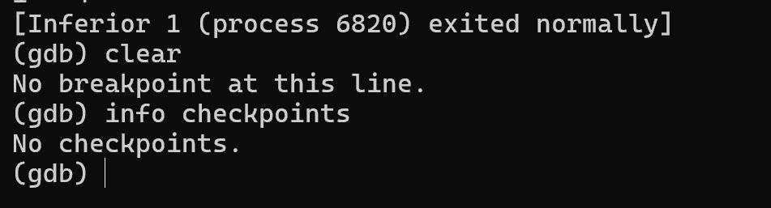
    

14. **退出GDB**：
    ```
    (gdb) quit
    ```
    或简写为：
    ```
    (gdb) q
    ```
    这将退出GDB调试会话。
    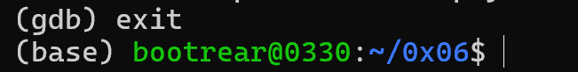

---

#### 步骤5：调试一个有未初始化变量的程序

创建一个名为`uninit.c`的文件，内容如下：

```c
#include <stdio.h>

int main() {
    int x;  // 未初始化的变量
    int y = 5;
    int z = x + y;  // 使用未初始化的变量
    
    printf("x = %d, y = %d, z = %d\n", x, y, z);
    
    return 0;
}
```

编译并使用GDB调试：

```bash
gcc -g -o uninit uninit.c
gdb ./uninit
```

在GDB中：
1. 设置断点在`main`函数：
   ```
   (gdb) break main
   ```

2. 运行程序：
   ```
   (gdb) run
   ```

3. 单步执行并观察变量值：
   ```
   (gdb) next
   (gdb) print x
   ```
   
   您会注意到变量`x`的值是未定义的（可能是一个随机值也可能默认为0）。此处是 `$1 = 1431654496` 。

4. 设置变量`x`的值并继续执行：
   ```
   (gdb) set x = 10
   (gdb) next
   (gdb) print z
   ```
   
   现在`z`的值应该是15（10 + 5）。

5. 继续执行程序：
   ```
   (gdb) continue
   ```

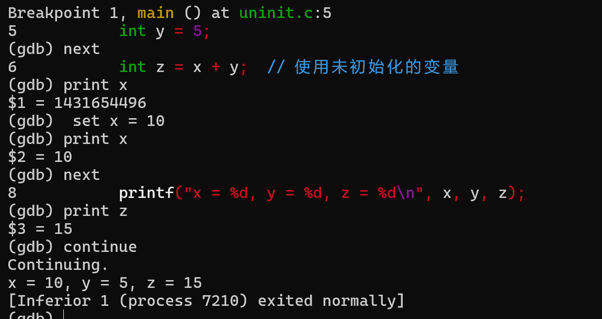

通过这些步骤，您将学习GDB的基本使用方法，包括如何设置断点、单步执行、查看和修改变量值。

---

### 实验二：使用GDB分析栈溢出漏洞

在这个实验中，我们将创建一个包含栈溢出漏洞的程序，并使用GDB分析这个漏洞。

#### 步骤1：创建一个有栈溢出漏洞的程序

创建一个名为`buffer_overflow.c`的文件，内容如下：

```c
#include <stdio.h>
#include <string.h>

void vulnerable_function(char *input) {
    char buffer[16];
    strcpy(buffer, input); // 不安全的函数，可能导致栈溢出
    printf("Buffer content: %s\n", buffer);
}

int main(int argc, char *argv[]) {
    if (argc < 2) {
        printf("Usage: %s <input_string>\n", argv[0]);
        return 1;
    }
    vulnerable_function(argv[1]);
    printf("Program executed normally\n");
    return 0;
}
```

#### 步骤2：编译程序

为了更好地演示栈溢出，我们需要关闭一些保护机制：

```bash
gcc -g -fno-stack-protector -z execstack buffer_overflow.c -o buffer_overflow
```


参数说明：
- `-g`: 生成调试信息
- `-fno-stack-protector`: 禁用栈保护
- `-z execstack`: 允许栈可执行

#### 步骤3：使用GDB分析程序

1. 启动GDB：
   ```bash
   gdb ./buffer_overflow
   ```

2. 设置断点：
   ```
   (gdb) break vulnerable_function
   (gdb) break main
   ```

3. 运行程序并提供一个短输入：
   ```
   (gdb) run "AAAA"
   ```
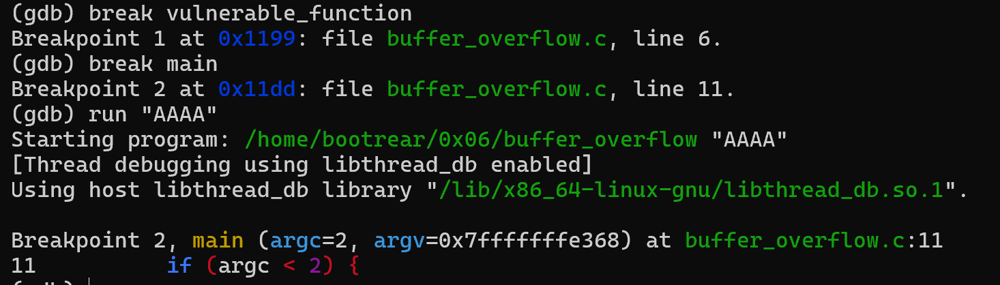
4. 观察栈的状态：
   ```
   (gdb) info frame
   (gdb) x/20xw $sp  # 查看栈上的20个字
   ```

```bash
## 输出
(gdb) info frame
Stack level 0, frame at 0x7fffffffe260:
 rip = 0x5555555551dd in main (buffer_overflow.c:11); saved rip = 0x7ffff7db0d90
 source language c.
 Arglist at 0x7fffffffe250, args: argc=2, argv=0x7fffffffe368
 Locals at 0x7fffffffe250, Previous frame's sp is 0x7fffffffe260
 Saved registers:
  rbp at 0x7fffffffe250, rip at 0x7fffffffe258
(gdb) x/20xw $sp
0x7fffffffe240: 0xffffe368      0x00007fff      0x555550a0      0x00000002
0x7fffffffe250: 0x00000002      0x00000000      0xf7db0d90      0x00007fff
0x7fffffffe260: 0x00000000      0x00000000      0x555551ca      0x00005555
0x7fffffffe270: 0xffffe350      0x00000002      0xffffe368      0x00007fff
0x7fffffffe280: 0x00000000      0x00000000      0x8008f24b      0x39aa7a4c
```

5. 继续执行并观察正常退出：
   ```
   (gdb) continue
   ```
   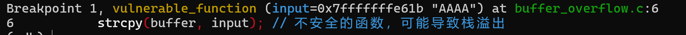

6. 重新运行程序，但提供一个长输入：
   ```
   (gdb) run $(python -c 'print("A"*30)')
   ```

7. 观察栈的状态，注意与之前的区别：
   ```
   (gdb) info frame
   (gdb) x/20xw $sp
   ```
```bash
(gdb) info frame
Stack level 0, frame at 0x7fffffffe240:
 rip = 0x5555555551dd in main (buffer_overflow.c:11); saved rip = 0x7ffff7db0d90
 source language c.
 Arglist at 0x7fffffffe230, args: argc=2, argv=0x7fffffffe348
 Locals at 0x7fffffffe230, Previous frame's sp is 0x7fffffffe240
 Saved registers:
  rbp at 0x7fffffffe230, rip at 0x7fffffffe238
(gdb) x/20xw $sp
0x7fffffffe220: 0xffffe348      0x00007fff      0x555550a0      0x00000002
0x7fffffffe230: 0x00000002      0x00000000      0xf7db0d90      0x00007fff
0x7fffffffe240: 0x00000000      0x00000000      0x555551ca      0x00005555
0x7fffffffe250: 0xffffe330      0x00000002      0xffffe348      0x00007fff
0x7fffffffe260: 0x00000000      0x00000000      0xb79c7121      0xa93a5a76

```

8. 继续执行，观察程序是否崩溃：
   ```
   (gdb) continue
   ```
   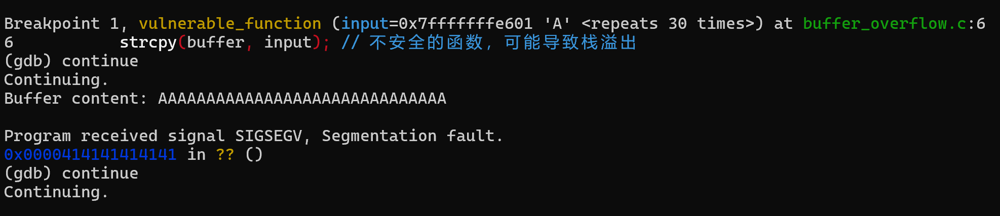

两种输入的输出对比：
```bash
(gdb) run "AAAA"
Starting program: /home/bootrear/0x06/buffer_overflow "AAAA"
[Thread debugging using libthread_db enabled]
Using host libthread_db library "/lib/x86_64-linux-gnu/libthread_db.so.1".
Buffer content: AAAA
Program executed normally
[Inferior 1 (process 29758) exited normally]
(gdb) run $(python -c 'print("A"*30)')
Starting program: /home/bootrear/0x06/buffer_overflow $(python -c 'print("A"*30)')
[Thread debugging using libthread_db enabled]
Using host libthread_db library "/lib/x86_64-linux-gnu/libthread_db.so.1".
Buffer content: AAAAAAAAAAAAAAAAAAAAAAAAAAAAAA

Program received signal SIGSEGV, Segmentation fault.
0x0000414141414141 in ?? ()
```

`x/20xw $sp` 指令：用于以十六进制格式，查看从栈顶开始的 20 个内存字的数据布局，可直观观察栈内存被覆盖的状况。

**输出差异与原因分析**：
输入 `"AAAA"` 时，数据未超过 `buffer` 数组容量（16字节），程序正常执行并退出。
输入30个 `"A"` 时，由于代码使用了不具备边界检查的 `strcpy` 函数，引发了**栈溢出**。超长输入的字符 `A`（16进制为 `0x41`）越过数组边界，向上**覆盖了栈中保存的函数返回地址（Saved RIP）**。

因此，当函数执行结束准备返回主程序时，CPU 错误地将 `0x4141414141414141` 作为下一条指令地址进行跳转，导致非法内存访问，最终引发段错误（Segmentation fault）使程序崩溃。

---

## 参考资料

1. [GDB Step by Step Introduction](https://www.geeksforgeeks.org/gdb-step-by-step-introduction/)
2. [Analyzing Buffer Overflow with GDB](https://www.geeksforgeeks.org/analyzing-bufferoverflow-with-gdb/)
3. [GDB Documentation](https://sourceware.org/gdb/current/onlinedocs/gdb/)
4. [栈溢出漏洞利用](https://www.wlhhlc.top/posts/54640/)